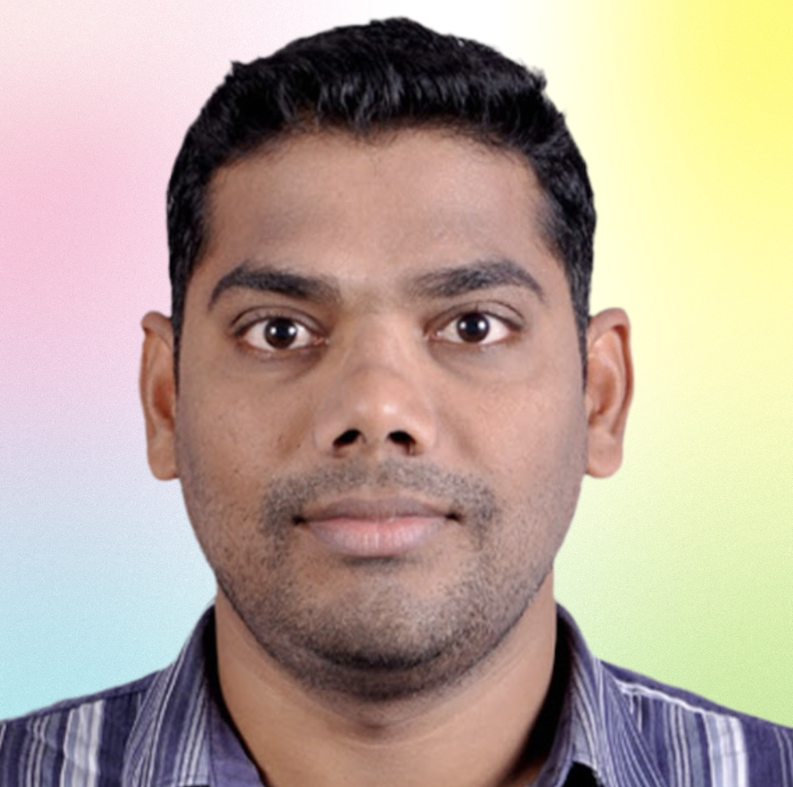

# About Me

{ align=right width=250 height=250 border-radius=50%}

**Anji Keesari** is a accomplished **Cloud Architect** with **over 20 years** of experience in software architecture, full-stack development, and Microsoft Azure Cloud solutions. Skilled at designing and delivering scalable, secure, and cloud-native applications, with expertise in .NET, Azure, Kubernetes, Kafka, Terraform, Helm, and Azure DevOps. Proven track record in leading enterprise transformation initiatives and scaling systems from startup to enterprise level.

**Current Role**: Currently working as a Cloud Architect, leading enterprise cloud transformation initiatives. Actively contributing to one of the major project – an architectural foundation for the company's next generation of digital products. This modern cloud-native platform is designed to become the organizational standard for all future projects, driving consistency, scalability, and innovation across teams.

**Previous Experience**: Spent many years in delivering large-scale software solutions across diverse domains and geographies, including the US, UK, and India (multiple states).

**Certifications**: Microsoft Azure, Microsoft .NET, and  The Open Group Architecture Framework **TOGAF** certified.

**Publications**: Author of two technical books:

*  _Building Microservices with Containers: A Practical Guide_        
*   _Build and Deploy Microservices on Kubernetes using ArgoCD & Helm_
        
**Entrepreneurship**: Founder of [https://anjikeesari.com](https://anjikeesari.com), where I share insights and tutorials on a wide range of technologies, including Azure, Kubernetes, PostgreSQL, MongoDB, Terraform, Helm, Azure DevOps, .NET, React, and more.

**Content Creation**: Regular contributor to **Medium.com**, where I publish articles on emerging cloud-native technologies and best practices.
    
**Startup Mindset**: Passionate about startup culture, with a proven ability to scale organizations from early-stage to enterprise level. Leverage deep technical expertise and architectural vision to create scalable, resilient, and future-ready solutions that support rapid growth and innovation.
    
**AI Exploration**: Currently exploring the AI ecosystem to identify strategic opportunities for incorporating intelligent systems into scalable architectures, ensuring alignment with business value and emerging technologies.

**Kubernetes Expertise:** Experience in deploying and managing Kubernetes clusters in production environments. Expert in **ArgoCD** and **Helmcharts** and has used these tools to deploy microservices applications on Kubernetes. 

**Infrastructure as Code(IaC) Expertise:** In addition to the experience with Kubernetes and related tools, I also have extensive experience with Terraform and deploy infrastructure on various cloud platforms, including Azure.

**Professional Experience:** Throughout my career, I have worked with various companies in different domains such as Banking, Healthcare, and Finance, across countries like India, UK, and US. I am passionate about making a significant impact at my workplace and helping others along the way.

**Personal Interests:** During free time, I finds joy in various activities such as playing soccer, going hiking, exploring new places, and most importantly, spending quality time with his loved ones.
