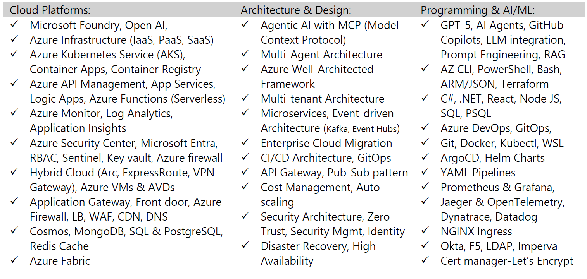

# Cloud Architect, Researcher & Technology Leader

{ align=right width=320 height=320 style="border-radius: 50%;"}

## Building the Future of Cloud Computing

I'm **Anji Keesari**, a Cloud Architect and technology leader with over 23 years of experience transforming how organizations build and operate in the cloud. Currently based in San Ramon, California, I combine deep technical expertise in Microsoft Azure, Kubernetes, AI/ML, and Infrastructure as Code with a passion for innovation, team empowerment, and driving industry-wide change through knowledge sharing.

What excites me most is not just building infrastructure, but reimagining how technology can solve complex business challenges, mentoring teams to reach their full potential, and exploring emerging paradigms like AI agents and intelligent automation that will shape the next decade of cloud computing.

---

-   **🏗️ Technical Leadership**

    ---

    As a Cloud Architect in the financial services sector, I lead the technical vision for enterprise cloud transformation:

    - Championing cloud-native thinking across organizations
    - Pioneering adoption of emerging technologies (AI agents, Azure AI Foundry, LLMs)
    - Architecting scalable, event-driven platforms
    - Building proof-of-concepts that demonstrate business value
    - Balancing innovation with stability and security

-   **📚 Research & Publications**

    ---

    Published peer-reviewed research in international journals:

    - **AI-Driven Algorithmic Trading** (IJECS, 2025)  
      Machine learning integration with technical indicators
    
    - **Cloud-Native Messaging Architectures** (IJARCSMS, 2025)  
      High-throughput Kubernetes and Azure Event Hub analysis

    **Research Focus**: Cloud architecture, AI/ML integration, distributed systems, algorithmic trading

    [View Research →](../research/index.md)

-   **🤝 Team Empowerment**

    ---

    Building high-performing teams through mentorship and collaboration:

    - Mentoring developers on cloud-native patterns and IaC
    - Building bridges between dev, ops, and security teams
    - Creating collaborative problem-solving cultures
    - Translating technical concepts for executive stakeholders
    - Connecting technology decisions to business outcomes

-   **🌍 Knowledge Sharing**

    ---

    Operating **anjikeesari.com** for 7+ years as a free educational platform:

    - **87 countries** global reach
    - **80+ technical articles** on Azure, Kubernetes, AI/ML
    - **2 free e-books** downloaded by thousands
    - **2,300+ YouTube subscribers**
    - **243 Medium followers**

    Democratizing enterprise cloud expertise worldwide

-   **🏆 Professional Recognition**

    ---

    Distinguished memberships and judging roles:

    - **IEEE Member** - Institute of Electrical and Electronics Engineers
    - **SAS Fellow** - International Society for Academic & Scientific Society
    - **IOASD Royal Fellow** - International Organization for Academic Development
    - **Globee Awards Judge** (2025) - Impact, Leaders, Business
    - **Stevie Awards Member** - Technology and innovation focus

    [View Awards →](../awards/index.md)

-   **🚀 Innovation Focus**

    ---

    Exploring cutting-edge technologies and emerging paradigms:

    - AI agents and AI Agent Frameworks for cloud operations
    - Azure AI Foundry and Azure OpenAI Service integration
    - Large Language Models (LLMs) and Model Context Protocol (MCP) servers
    - Infrastructure as Code best practices (Terraform, Bicep)
    - Kubernetes with ArgoCD and Helm Charts for GitOps workflows

---

## Core Technical Expertise

**Cloud Architecture & Platforms:**  
Microsoft Azure • Azure Kubernetes Service (AKS) • Azure OpenAI Service • Azure AI Foundry • Azure Event Hub • Infrastructure as Code

**AI/ML & Emerging Technologies:**  
Artificial Intelligence • Machine Learning • AI Agents • AI Agent Frameworks • Large Language Models (LLMs) • Model Context Protocol (MCP) Servers • Intelligent Automation

**Container Orchestration & Microservices:**  
Kubernetes • Docker • ArgoCD • Helm Charts • Microservices Architecture • Event-Driven Systems

**Development & Automation:**  
Infrastructure as Code (IaC) • Terraform • Bicep • ARM Templates • CI/CD • Azure DevOps • C# • .NET • React JS

**Enterprise Solutions:**  
Cloud-Native Applications • Distributed Systems • High-Throughput Architectures • Security & Compliance (SOC 2, FINRA, SEC)

[{:style="border: 1px solid #d1d5db; border-radius: 10px; margin-top: 1rem;"}](image-1.png){:target="_blank"}

---

## Professional Philosophy

> "The best architectures solve today's problems while preparing for tomorrow's opportunities. But technical excellence alone isn't enough—I believe in multiplying impact by sharing what I learn freely. Every tutorial I write, every pattern I document, and every engineer I mentor creates ripples that extend far beyond any single project. That's how we advance not just our careers, but our entire field."

---

## Beyond Technology

During free time, I find joy in playing soccer, hiking through California trails, exploring new places, and most importantly, spending quality time with family and loved ones. These activities provide balance and fresh perspectives that fuel creativity in problem-solving.

---

## Let's Connect

Interested in cloud architecture, AI/ML integration, or collaboration opportunities? [Get in touch →](../contact/index.md)
