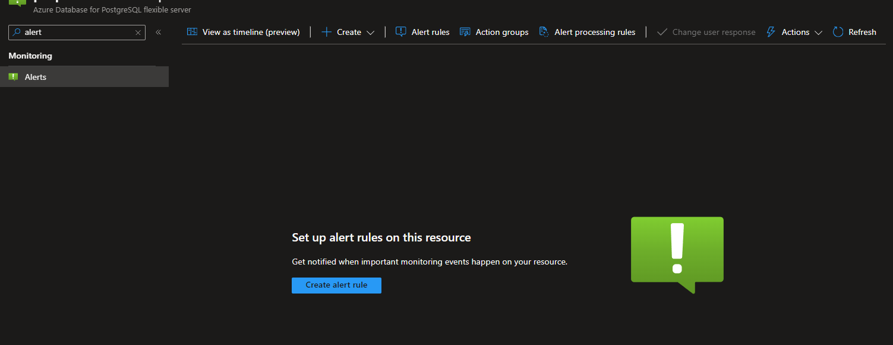
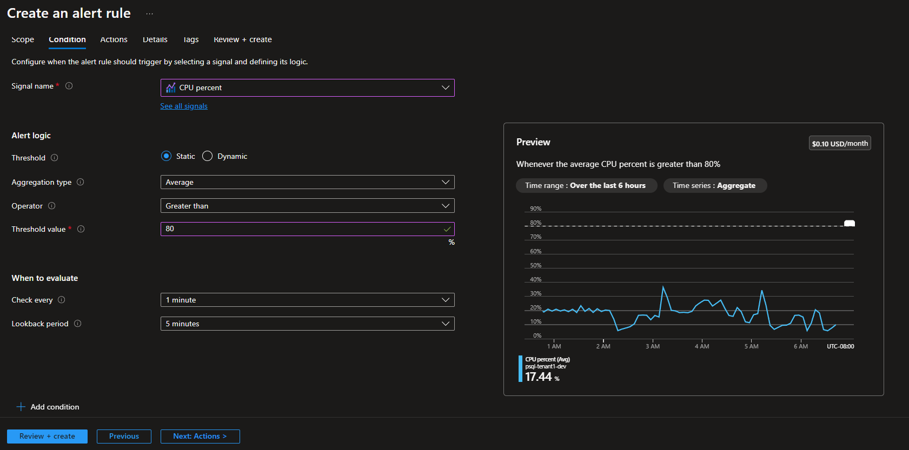
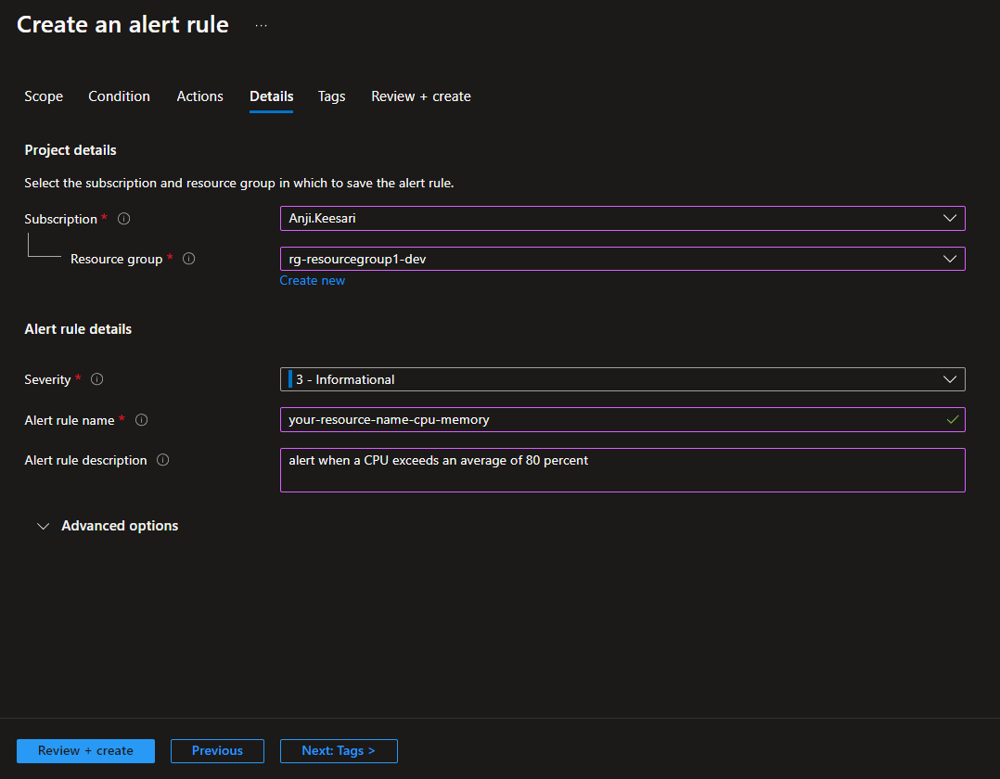
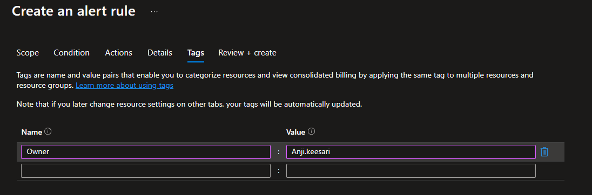
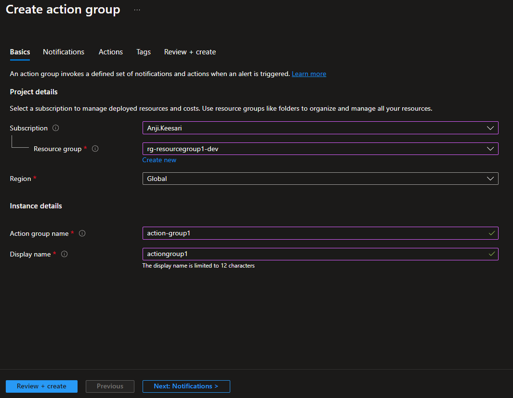
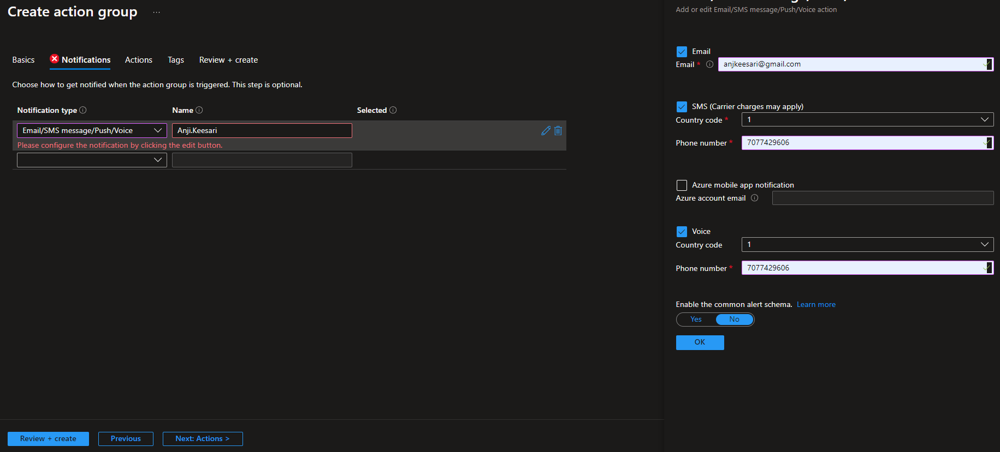
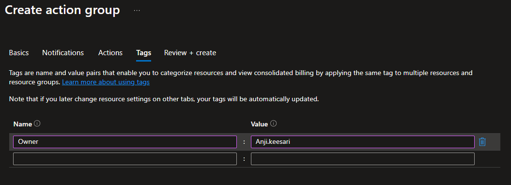
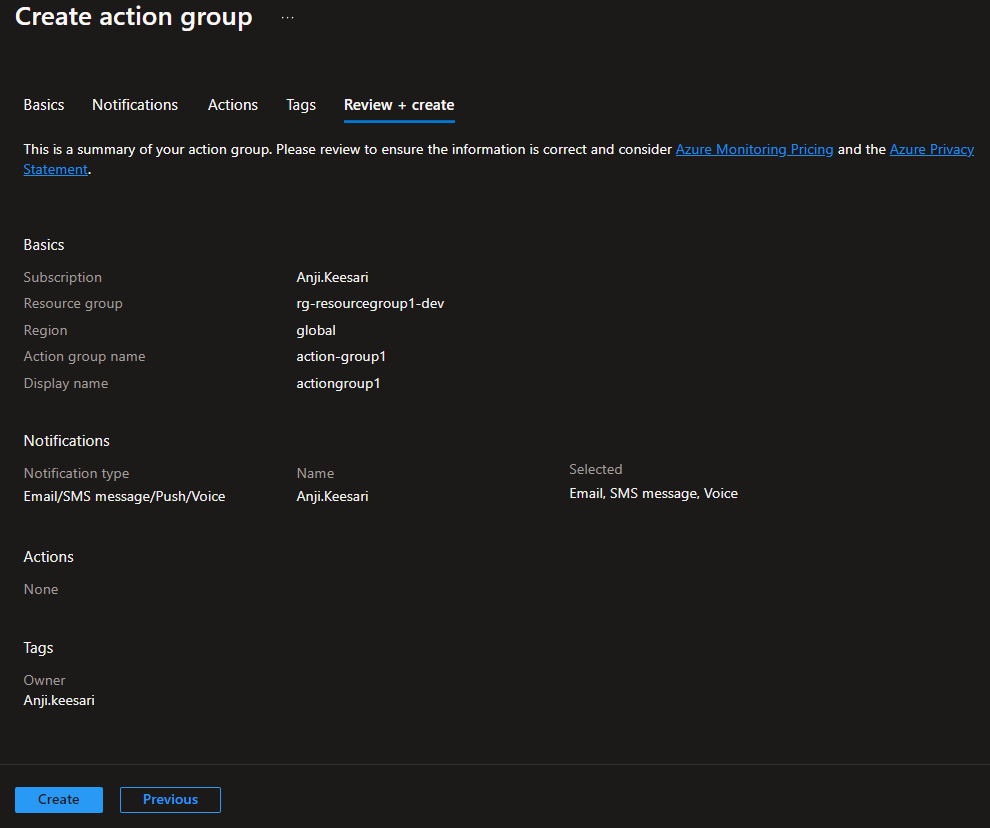
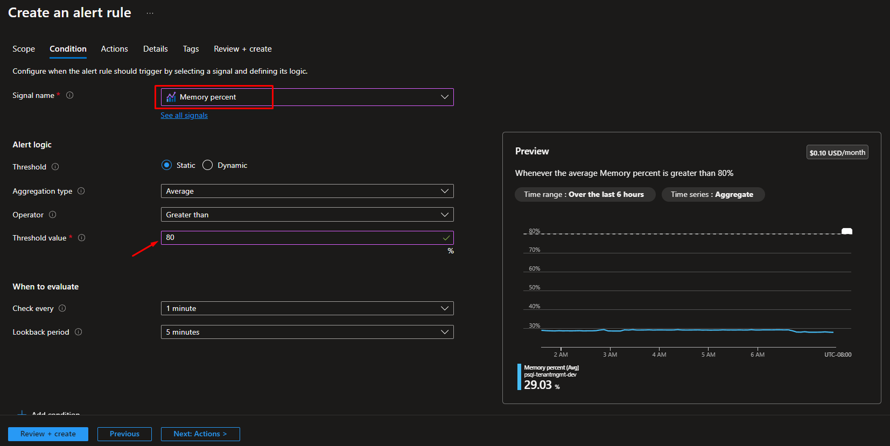

# **Setup Azure Monitor Alerts for CPU & Memory exceeds for PostgreSQL - using Terraform**

## **Introduction**

Monitoring and managing your Azure resources are always crucial for any kind of project, and setting up alerts for CPU and memory spikes, especially in database systems like PostgreSQL or SQL Server, is very important and necessary.

Whether you're using PostgreSQL or SQL Server databases on Azure, monitoring their performance metrics such as CPU and memory utilization is essential for ensuring optimal performance and availability. Setting up alerts for CPU and memory exceeds allows you to proactively address potential issues before they impact your applications and users.

In this article, I will guide you through the steps to set up email, SMS, or voice notifications for your team members when CPU & Memory exceeds more than 80% for PostgreSQL.

<!-- 
Introduction
Prerequisites
Create an alert when CPU exceeds an average of 80 percent
Create an alert when Memory exceeds an average of 80 percent
Test Alert Rule
Setup Alert Using Terraform
Conclusion
References

-->


## **Prerequisites**

Before setting up Azure Monitor alerts for CPU and memory spikes in your PostgreSQL or SQL Server databases, ensure the following prerequisites are met:

1. An active Azure subscription.
2. Access to Azure portal with appropriate permissions.
3. PostgreSQL or SQL Server database deployed and running on Azure.
4. Azure Monitor configured to monitor your database metrics.


## **Create an alert when CPU exceeds an average of 80 percent**

1. **Navigate to Azure Monitor:** Go to the Azure portal (https://portal.azure.com) and navigate to your Azure Monitor instance.

2. **Create New Alert Rule:** Select the appropriate resource (PostgreSQL or SQL Server database) from the list of monitored resources.
[{:style="border: 1px solid black; border-radius: 10px;"}](images/alerts/cpu-memory-image-1.png){:target="_blank"} 
3. **Set Conditions:** Under the "Alerts" section, click on "New alert rule" and select the condition type as "Metric alert."

4. **Define Condition:** Choose the appropriate metric (e.g., "CPU percentage") and set the condition to "Greater than" and the threshold to 80 percent.
[{:style="border: 1px solid black; border-radius: 10px;"}](images/alerts/cpu-memory-image-2.png){:target="_blank"} 
5. **Configure Alert Details:** Provide a meaningful name and description for the alert. You can also customize the severity level and alert frequency as per your requirements.
[{:style="border: 1px solid black; border-radius: 10px;"}](images/alerts/cpu-memory-image-7.png){:target="_blank"} 
[{:style="border: 1px solid black; border-radius: 10px;"}](images/alerts/cpu-memory-image-8.png){:target="_blank"} 
6. **Set Action Group:** Specify the action group to be notified when the alert is triggered. This could include sending emails, SMS notifications, or triggering automated remediation tasks.
[{:style="border: 1px solid black; border-radius: 10px;"}](images/alerts/cpu-memory-image-3.png){:target="_blank"} 
[{:style="border: 1px solid black; border-radius: 10px;"}](images/alerts/cpu-memory-image-4.png){:target="_blank"} 
[{:style="border: 1px solid black; border-radius: 10px;"}](images/alerts/cpu-memory-image-5.png){:target="_blank"} 
[{:style="border: 1px solid black; border-radius: 10px;"}](images/alerts/cpu-memory-image-6.png){:target="_blank"} 

7. **Review and Create:** Review the alert rule configuration and click on "Create" to finalize the setup.

## **Create an alert when Memory exceeds an average of 80 percent**

1. Follow the same steps as above, but this time select the memory metric instead of CPU.
[{:style="border: 1px solid black; border-radius: 10px;"}](images/alerts/cpu-memory-image-9.png){:target="_blank"} 
2. Set the condition to "Greater than" and the threshold to 80 percent.

3. Configure the alert details and action group as per your preferences.

4. Review and create the alert rule.


## **Test Alert Rule**

To ensure that the alert rules are working as expected, you can simulate a CPU or memory spike in your PostgreSQL or SQL Server database. This can be done by running resource-intensive queries or scripts against the database.

Once the CPU or memory exceeds the defined threshold, Azure Monitor will trigger the corresponding alert, and notifications will be sent to the specified action group.

## **Setup Metric Alert Using Terraform**

Below are the steps to set up Azure Monitor alerts for CPU and memory exceeds using Terraform for PostgreSQL or SQL Server databases:

**Step 1: Install Terraform:**
If you haven't already installed Terraform, you can download it from the official website: https://www.terraform.io/downloads.html. Follow the installation instructions for your operating system.

**Step 2: Configure Azure Provider:**
Create a new directory for your Terraform configuration and create a file named `main.tf`. In this file, configure the Azure provider with your Azure credentials.

```hcl
provider "azurerm" {
  features {}
}
```

**Step 3: Define Alert Rule Resources:**
Add resource definitions for creating alert rules for CPU and memory exceeds. Specify the appropriate metric and condition for each alert rule.

Memory Utilization:

```hcl
// This alert will be triggered when Memory Utilization exceeds 80% for longer than 5 minutes
resource "azurerm_monitor_metric_alert" "psql_memory_usage" {
  name                = "${azurerm_postgresql_flexible_server.psql.name}-memory_usage"
  resource_group_name = azurerm_resource_group.rg.name
  scopes              = [azurerm_postgresql_flexible_server.psql.id]
  description         = "Action will be triggered when Memory utilization exceeds 80% for longer than 5 minutes"
  frequency           = "PT5M"
  window_size         = "PT5M"
  auto_mitigate = true
  enabled = true
  severity            = 1
  criteria {
    metric_namespace = "Microsoft.DBforPostgreSQL/flexibleServers"
    metric_name      = "memory_percent"
    aggregation      = "Average"
    operator         = "GreaterThan"
    threshold        = 80
  }

  action {
    action_group_id = "<your-action-group-id>"
  }
  tags = "default_tags goes here"
  depends_on = [
    azurerm_resource_group.rg,
    azurerm_postgresql_flexible_server.psql,    
  ]
  lifecycle {
    ignore_changes = [
      tags,
    ]
  }
}
```

CPU Utilization:

```hcl

// This alert will be triggered when CPU Utilization exceeds 80% for longer than 5 minutes
resource "azurerm_monitor_metric_alert" "psql_cpu_usage" {
  name                = "${azurerm_postgresql_flexible_server.psql.name}-cpu_usage"
  resource_group_name = azurerm_resource_group.rg.name
  scopes              = [azurerm_postgresql_flexible_server.psql.id]
  description         = "Action will be triggered when CPU utilization exceeds 80% for longer than 5 minutes"
  frequency           = "PT5M"
  window_size         = "PT5M"
  severity            = var.alert_severity
  criteria {
    metric_namespace = "Microsoft.DBforPostgreSQL/flexibleServers"
    metric_name      = "cpu_percent"
    aggregation      = "Average"
    operator         = "GreaterThan"
    threshold        = 80
  }

  action {
    action_group_id = "<your-action-group-id>"
  }
  tags = "default_tags goes here"
  depends_on = [
    azurerm_resource_group.rg,
    azurerm_postgresql_flexible_server.psql,    
  ]
  lifecycle {
    ignore_changes = [
      tags,
    ]
  }
}
```

Replace `<your-resource-group-name>`, `<your-database-resource-id>`, and `<your-action-group-id>` with your actual Azure resource group name, database resource ID, and action group ID respectively.

**Step 4: Initialize and Apply Terraform Configuration:**
Initialize Terraform in your working directory and apply the configuration.

```bash
terraform init
terraform plan
terraform apply
```

By following these steps, you can set up Azure Monitor alerts for CPU and memory exceeds using Terraform for PostgreSQL or SQL Server databases.


## **Conclusion**

Setting up Azure Monitor alerts for CPU and memory exceeds is crucial for maintaining the performance and availability of your PostgreSQL or SQL Server databases on Azure. By proactively monitoring these metrics and configuring alerts, you can quickly identify and address potential issues before they escalate, ensuring a seamless experience for your applications and users.


## **References**
- [Microsoft Azure Documentation:](https://docs.microsoft.com/en-us/azure/){:target="_blank"}
- [Azure Monitor Overview:](https://azure.microsoft.com/en-us/services/monitor/){:target="_blank"}
- [Azure Monitor Alerts Documentation:](https://learn.microsoft.com/en-us/azure/azure-monitor/alerts/alerts-manage-alert-instances){:target="_blank"}
- [Manages a Metric Alert within Azure Monitor:](https://registry.terraform.io/providers/hashicorp/azurerm/latest/docs/resources/monitor_metric_alert){:target="_blank"}

<!-- 
https://microsoftlearning.github.io/dp-300-database-administrator/Instructions/Labs/12-create-cpu-status-alert.html#:~:text=Create%20an%20alert%20when%20a%20CPU%20exceeds%20an%20average%20of%2080%20percent,-In%20the%20search&text=Select%20Alerts.,Static%20for%20the%20Threshold%20property.

# https://github.com/DFE-Digital/terraform-azurerm-container-apps-hosting/blob/main/monitor.tf
# https://registry.terraform.io/providers/hashicorp/azurerm/latest/docs/resources/monitor_metric_alert#metric_name
# https://learn.microsoft.com/en-us/azure/azure-monitor/alerts/alerts-metric-near-real-time
 -->
