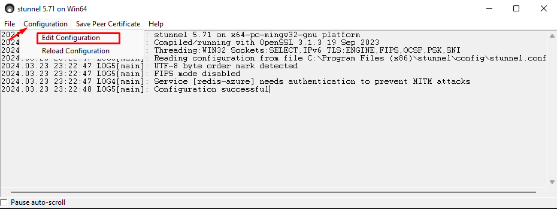
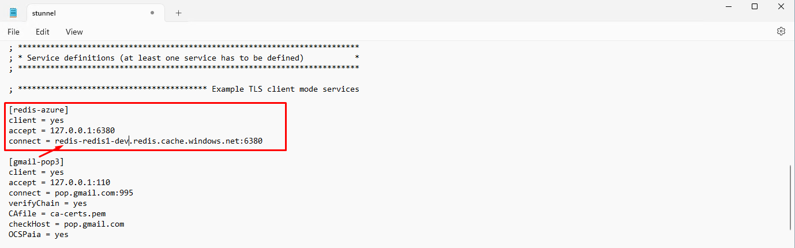
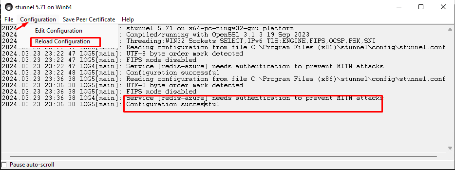
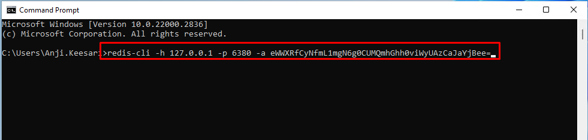
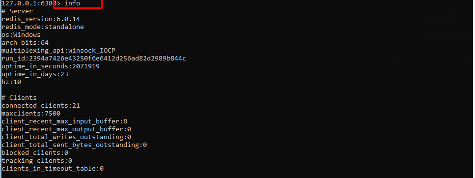

# **Connecting to Azure Cache for Redis with redis-cli and stunnel**

## **Introduction**

Azure Cache for Redis is a fully managed, open-source, in-memory data store that is used for improving the performance of applications in Microservices architecture. In Azure, security is something always important, and as such, the Azure redis cache non-SSL port (6379) is often disabled with SSL enabled. also, when utilizing private endpoints, direct connections to Azure Cache for Redis become restricted. In this scenario, connecting to Azure Cache for Redis requires additional steps.

In this article, we will walk through the process of connecting to Azure Cache for Redis using `redis-cli` along with `stunnel` tools. `stunnel` acts as a secure tunneling tool, enabling SSL encryption for the connection, while `redis-cli` serves as the command-line interface to interact with Redis.

## **Prerequisites**

Before proceeding, ensure you have the following prerequisites installed:

- `stunnel`: Download and install `stunnel` from the official website [here](https://www.stunnel.org/downloads.html){:target="_blank"}.
- `redis-cli`: Download and install `redis-cli` from the GitHub repository [here](https://github.com/microsoftarchive/redis/releases){:target="_blank"} or [here](https://github.com/redis/redis-hashes/){:target="_blank"}.
- Virtual Machine (Jumpbox) in the same network as the private endpoint of redis


## **Step 1: Login Virtual Machine (jumpbox)** 

It's essential to have a virtual machine deployed within the same virtual network as the Azure Cache for Redis instance. This ensures that the virtual machine can establish a secure connection to the Redis cache without relying on public endpoints or traversing the internet. you need to first login into this Virtual Machine (VM) in the same network as the private endpoint of redis.

Test Redis Connection from jumpbox before making any further steps to make sure connection is successful.

**Test-NetConnection**

```
Test-NetConnection -Port 6380 -ComputerName redis-redis1-poc.redis.cache.windows.net
```

```
ComputerName     : redis-redis1-poc.redis.cache.windows.net
RemoteAddress    : 10.64.3.7
RemotePort       : 6380
InterfaceAlias   : Ethernet 3
SourceAddress    : 10.24.50.78
TcpTestSucceeded : True
```

**nslookup**

```
nslookup redis-redis1-poc.privatelink.redis.cache.windows.net
```

```
Server:  UnKnown
Address:  168.63.129.14

Non-authoritative answer:
Name:    redis-redis1-poc.privatelink.redis.cache.windows.net
Address:  10.64.3.6
```

## **Step 2: Download and install stunnel**

Download and install `stunnel` from the provided link. Follow the installation instructions provided by the installer.

## **Step 3: Download and install redis-cli**

Download and install `redis-cli` from the provided GitHub repository links. Follow the installation instructions for your respective operating system.

## **Step 4: Configure stunnel to connect to Azure Cache**

1. Open `stunnel` and click on "Edit Configuration".
   [{:style="border: 1px solid black; border-radius: 10px;"}](images/redis/image-0.png){:target="_blank"} 
      
2. Update the Azure Redis Cache endpoint details in the configuration file.

    [{:style="border: 1px solid black; border-radius: 10px;"}](images/redis/image-1.png){:target="_blank"} 
  
3. Reload the configuration in `stunnel`. You should see a "Connection successful" message.
   
    [{:style="border: 1px solid black; border-radius: 10px;"}](images/redis/image-2.png){:target="_blank"} 

## **Step 5: Start stunnel and connect**

1. Start `stunnel`.
   
2. Open a command prompt or PowerShell window and enter the `redis-cli` command along with the appropriate authentication key obtained from the Azure Cache for Redis authentication settings.

    [{:style="border: 1px solid black; border-radius: 10px;"}](images/redis/image-3.png){:target="_blank"} 
   
3. Test the Redis connection by entering commands such as `info`.

    [{:style="border: 1px solid black; border-radius: 10px;"}](images/redis/image-4.png){:target="_blank"} 

You have now successfully connected to Azure Cache for Redis using the `stunnel` tool.

## **Conclusion**

Connecting to Azure Cache for Redis, especially when SSL is enforced and private endpoints are in use, requires additional steps beyond a direct connection. By utilizing `stunnel` to create a secure tunnel and `redis-cli` to interact with Redis, you can securely access your Azure Cache for Redis instance.

## **References**

- [stunnel Downloads](https://www.stunnel.org/downloads.html)
- [Microsoft Archive Redis Releases](https://github.com/microsoftarchive/redis/releases)
- [Redis Hashes Releases](https://github.com/redis/redis-hashes/)