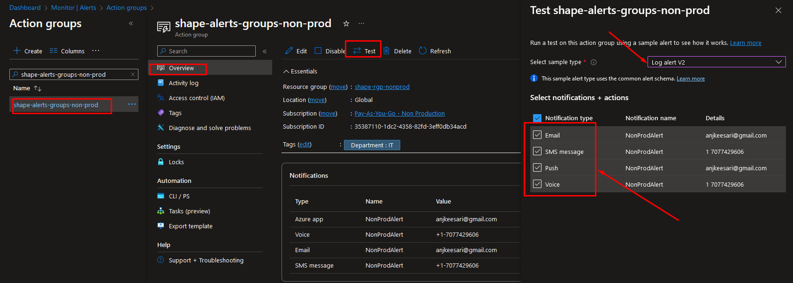
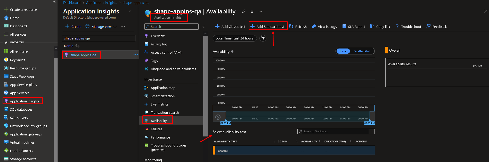
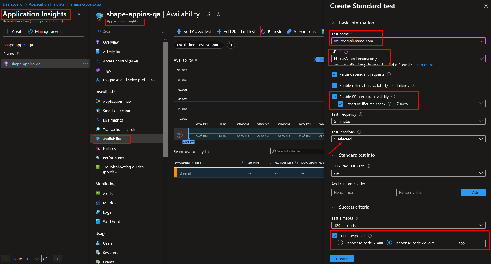
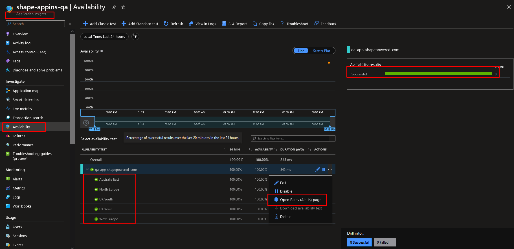
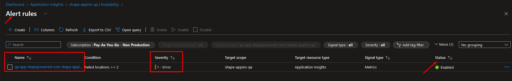
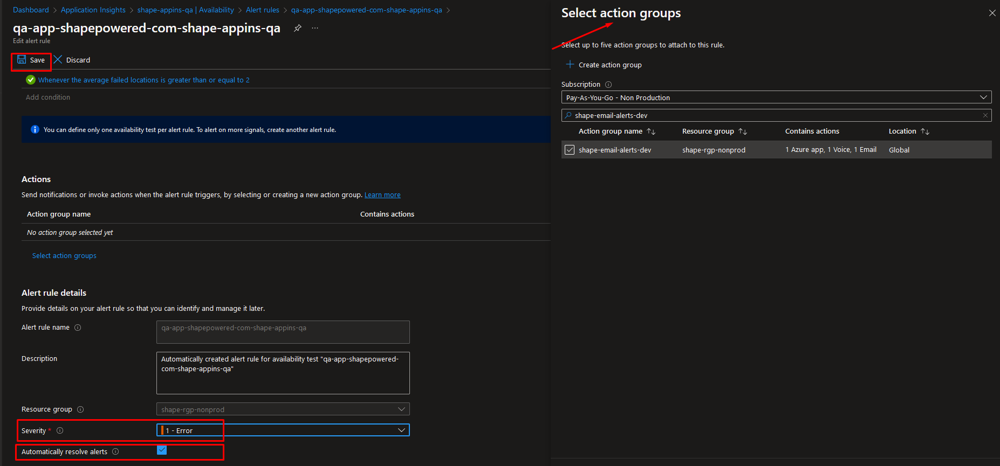
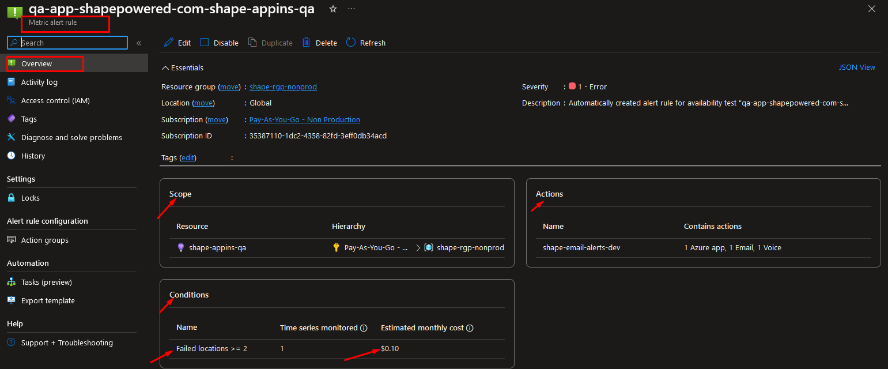

# **Send Alerts When Website is Down - Azure Application Insights Availability Test**

## **Introduction**

Website downtime can be a critical issue for companies in industries such as Insurance, Healthcare, Finance, and Banking, especially for applications that are mission critical. It can lead to inconvenience for users and potentially result in significant financial losses. To proactively address this challenge, Azure Application Insights offers a powerful feature called availability tests. These tests enable you to monitor your website's availability and receive timely alerts if the site goes down.

In this article, I will guide you through the steps to set up email, SMS, or voice notifications for your team members using Azure Application Insights.

## **Prerequisites**

Before we look into the steps, make sure you have the following prerequisites are in place:

- An Azure account with an active subscription.
- A web application hosted on Azure
- A Application Insights associated to the web application.

Now, let's get started!

## **Step 1: Create Action Groups**

Action Group allows you to define a set of notification and automated actions that can be triggered by alerts from various Azure services.

look into my other article for more details on [Create Action Groups](https://anjikeesari.com/articles/azure-log-alerts/#step-1-create-action-groups){:target="_blank"}

Action Group > Overview

{:target="_blank"}

## **Step 2: Add Standard Test in Application Insights**

here are the steps to "Add Standard Test in Application Insights" under the "Availability" left navigation:

1. Access Azure Portal

2. Select your application insights
3. Navigate to availability from left nav
4. Click on Add Standard Test
5. Configure Application URL
   
    - Enter the complete URL of your website, including the protocol (e.g., https://www.example.com).

6. Select test locations

    - In the "Locations" section, you can choose the geographic locations from where you want to run the availability test. Azure offers a variety of locations worldwide to ensure comprehensive coverage.

    - Click on "Add location" to select additional testing locations if needed.

7. Configure HTTP response codes:

    - Under the "Availability" tab, you can specify the expected HTTP response codes that indicate your website is running correctly. These codes are used to determine whether the test passes or fails. - in this scenario select 200 status code

    - You can also set up more advanced scenarios by configuring content checks in the "Content" tab.

8. Save and create test:

    - After configuring the test settings, click the "Create" or "Save" button to create the availability test. Azure Application Insights will now regularly run this test to check the availability of your website from the selected locations.

9. Verification:

    - To verify that the test is working as expected, you can check the test results in the "Availability" section. It will display the status of the test and any detected availability issues.

Application Insights > Availability

{:target="_blank"}

Availability > Add Standard Test

{:target="_blank"}

Add Standard Test > Results

{:target="_blank"}

## **Step 3: Create Alert Rule**

Now that your availability test is set up, it's time to create an alert rule to trigger notifications when issues arise. by default it already creates a Rule for this.

Click on "Open Rules Alerts page"

Update Alert Rule details like description, severity, automatically resolve alerts checkbox etc.. 

**Configure Actions group**

1. Click on "Select Action group" section of the alert rule and choose "Action groups.
2. Associate the alert rule with the Action Group you created in Step 1.

Alert Rule

{:target="_blank"}

Alert Rule > Details

{:target="_blank"}

Alert Rule > Scope, Action, Condition

{:target="_blank"}

## **Conclusion**

By following these steps, you can set up proactive monitoring and alerting for your website using Azure Application Insights availability tests. This ensures that your team members added in action groups are immediately notified when your website is downtime, allowing for quicker response times and minimizing user disruption.

## **References**

Here are some helpful references for further information:

- [Azure Application Insights Documentation](https://docs.microsoft.com/en-us/azure/azure-monitor/app/monitor-web-app-availability){:target="_blank"}
- [Azure Action Groups Documentation](https://learn.microsoft.com/en-us/azure/azure-monitor/alerts/action-groups){:target="_blank"}
- [Azure Monitor Alerts Documentation](https://learn.microsoft.com/en-us/azure/azure-monitor/alerts/alerts-overview){:target="_blank"}