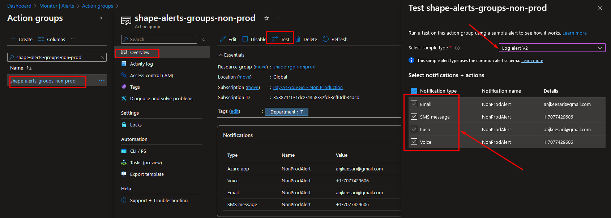

# **Setup Azure Logs Alerts & Notifications for Application Exceptions**
## **Introduction**

Monitoring and detecting application exceptions is crucial for maintaining the reliability and performance of your applications hosted on Azure. Azure Log Analytics and Azure Monitor provide powerful tools to help you achieve this. 

In this article, I will provide step by step instructions for setting up Azure Logs Alerts and Notifications specifically for application exceptions.

## **Prerequisites**

Before you begin, ensure you have the following prerequisites:

- An Azure account with an active subscription.
- A web application hosted on Azure 
- A Application Insights associated to the web application.
- A web application configured to send logs data to Azure Application Insights.
- An Azure Log Analytics workspace set up to collect logs from your application.
- Diagnostics Settings configured for your application's logs to send exceptions to the Log Analytics workspace.

## **Step 1: Create Action Groups**

Action Group allows you to define a set of notification and automated actions that can be triggered by alerts from various Azure services.

### Step 1.1: Action Groups Structure

Before creating action groups, let me provide some valuable tips here.

The number and structure of action groups you need to create can vary based on your application team size and the nature of your project. It's important to modify your approach to meet your specific requirements and needs.

Here are a few suggestions:

1. **Single Action Group for All Environments:** You can opt for a single action group that covers all your environments. This approach simplifies management and is suitable for smaller teams.

2. **Separate Action Groups for Each Environment:** You can set up separate action groups for individual environments. This provides more granularity and allows you to modify notifications and responses to each environment's unique characteristics.

3. **One for Non-Production and One for Production:** For smaller teams, it's often practical to create two action groups—one dedicated to non-production environments and the other focused on the production environment. This way, you can prioritize alerts and responses accordingly.

For larger applications with complex microservices architectures, consider creating separate action groups for each domain or team group. This approach ensures that alerts are directed to the right teams, facilitating efficient issue resolution.

The structure and number of action groups you create should align with your team's size, project complexity, and operational requirements. 


### Step 1.1: Create Action Groups

Here is the list of steps to create action group:

1. Sign in to the Azure Portal.

2. In the left navigation pane, click on "Monitor."

3. Under "Alerts," click on "Action groups."

4. Click on the "+ New action group" button.

5. Under **Resource group**, select the appropriate resource group.

6. In the "Basics" tab, provide a unique **Name** and **Short Name** for the action group.

7. In the "**Notifications**" section, configure the action to notify relevant stakeholders for non-production environments. You can set up email notifications, SMS, or other preferred communication channels.

8. Click "**OK**" to create the action group.

Action Group

[{:style="border: 1px solid black; border-radius: 10px;"}](images/azure-log-alerts-1.png){:target="_blank"}

Action Group > Basic

[{:style="border: 1px solid black; border-radius: 10px;"}](images/azure-log-alerts-2.png){:target="_blank"}

Action Group > Notification

[{:style="border: 1px solid black; border-radius: 10px;"}](images/azure-log-alerts-3.png){:target="_blank"}

Action Group > Tags

[{:style="border: 1px solid black; border-radius: 10px;"}](images/azure-log-alerts-4.png){:target="_blank"}


### Step 1.2: Test Action Group

Before proceeding to the alert rule setup, test the action group by simulating an alert. This will ensure that notifications are properly configured and reaching the intended recipients.

Action Group > Test

Test Alerts

[{:style="border: 1px solid black; border-radius: 10px;"}](images/azure-log-alerts-5.png){:target="_blank"}

Email from mail box

[{:style="border: 1px solid black; border-radius: 10px;"}](images/azure-log-alerts-6.png){:target="_blank"}

Email from mail box

[{:style="border: 1px solid black; border-radius: 10px;"}](images/azure-log-alerts-7.png){:target="_blank"}


## **Step 2: Create a new alert rule**

1. In the Azure Portal, under "Monitor," click on "Alert rules."

2. Click the "+ New alert rule" button.

### Step 2.1: Setup Conditions

1. In the "Basics" tab, choose the appropriate **Resource type** and **Resource** for your application.

2. Under the "Conditions" section, click on "+ Add condition."

3. In the condition configuration: Choose "Custom log search" as the signal type.

4. Click "Done" to save the condition.


Monitoring > Alert Rule 

[{:style="border: 1px solid black; border-radius: 10px;"}](images/azure-log-alerts-8.png){:target="_blank"}

or 

Web App or Api App > Alert Rule 

[{:style="border: 1px solid black; border-radius: 10px;"}](images/azure-log-alerts-9.png){:target="_blank"}

Alert Rule > Condition

[{:style="border: 1px solid black; border-radius: 10px;"}](images/azure-log-alerts-10.png){:target="_blank"}


### Step 2.2: Write Log Query

The log query written should accurately filter and select the exceptions you want to monitor. Make sure it targets the relevant log data and time frame.

Write a log query that selects application exceptions. For example:

```sh
exceptions
| where timestamp > ago(1h)
```

```sh
AppServiceAppLogs
| where TimeGenerated > ago(30m)
| order by TimeGenerated desc
| take 100
```

Adjust the time range and query as per your requirements.


Alert Rule > Log Query

[{:style="border: 1px solid black; border-radius: 10px;"}](images/azure-log-alerts-11.png){:target="_blank"}


### Step 2.3: Associate Action Group

1. In the "Actions" section, click on "+ Add action group."

2. Choose the action group created for the specific environment (non-production or production) where the alert will be triggered.

3. Configure the alert action settings, including the severity and threshold.

4. Click "OK" to associate the action group with the alert rule.

Alert Rule > Action Group

[{:style="border: 1px solid black; border-radius: 10px;"}](images/azure-log-alerts-12.png){:target="_blank"}


Alert Rule > Details

[{:style="border: 1px solid black; border-radius: 10px;"}](images/azure-log-alerts-13.png){:target="_blank"}

Alert Rule > Overvie

[{:style="border: 1px solid black; border-radius: 10px;"}](images/azure-log-alerts-14.png){:target="_blank"}

### Step 2.4: Test Alert Rule

Before finalizing the alert rule, it's essential to test it by creating a simulated exception or by adjusting the log query to match actual exceptions. This ensures that alerts trigger as expected.

[{:style="border: 1px solid black; border-radius: 10px;"}](images/azure-log-alerts-15.png){:target="_blank"}

[{:style="border: 1px solid black; border-radius: 10px;"}](images/azure-log-alerts-16.png){:target="_blank"}

## **Conclusion**

Setting up Azure Logs Alerts & Notifications for Application Exceptions is a proactive approach to identifying and addressing issues in your applications. By following the steps outlined in this guide, you can ensure that relevant teams are promptly notified when exceptions occur, allowing for timely troubleshooting and maintenance.

## **References**

- [Azure Monitor Documentation](https://docs.microsoft.com/en-us/azure/azure-monitor/){:target="_blank"}
- [Azure Log Analytics Documentation](https://learn.microsoft.com/en-us/azure/azure-monitor/logs/log-analytics-overview){:target="_blank"}
- [Azure Action Groups Documentation](https://docs.microsoft.com/en-us/azure/azure-monitor/platform/action-groups){:target="_blank"}
- [Create or edit a log alert rule](https://learn.microsoft.com/en-us/azure/azure-monitor/alerts/alerts-create-log-alert-rule){:target="_blank"}
<!-- 
- https://registry.terraform.io/providers/hashicorp/azurerm/latest/docs/resources/monitor_scheduled_query_rules_alert_v2
- https://stackoverflow.com/questions/74684628/how-to-create-azure-monitor-log-alerts-with-custom-kql-query-using-terrafrom
- https://learn.microsoft.com/en-us/azure/azure-monitor/alerts/alerts-create-log-alert-rule 
-->
