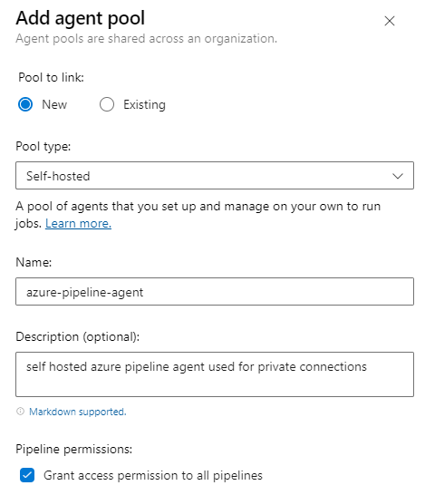
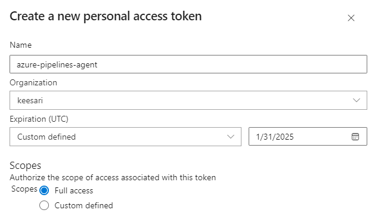
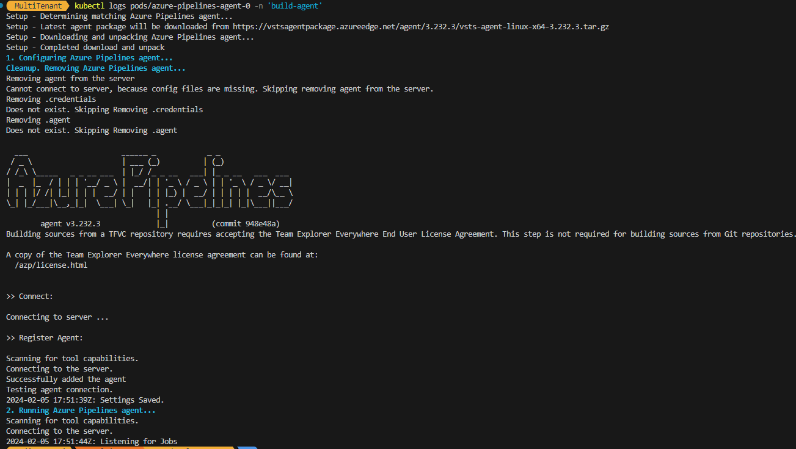

#  Setting up Self-Hosted Azure Pipelines Private Agents in AKS

## Introduction

This article will guide you through the process of setting up a self-hosted Azure pipelines private agent in an Azure Kubernetes Service (AKS) cluster using Helm charts for installation.

<!-- Introduction
Technical Scenario
Objective
Prerequisites
Implementation Details
Step 1: Deployment in Docker
Step 2: Deployment in Kubernetes using Helm
Step 3: Create a new agent pool in Azure DevOps
Step 4: Create a new Personal Access Token (PAT)
Step 5: Register the Self-Hosted Agent
Step 6: Verify the helm deployment
Step 7: Update Build pipeline with Private Agent
Step 8: Test the new Private Agent
Conclusion
Reference -->

**What is the private agent in azure devops?**

A private agent in Azure DevOps is a self-hosted agent that you can set up and manage within your own infrastructure. These agents are used to run build and release jobs in your CI/CD pipelines.

Here are some key characteristics of a private agent in Azure DevOps:

- **Self-Hosted**: Unlike the hosted agents provided by Azure DevOps, which are managed by Microsoft and run in a shared environment, private agents are self-hosted by you or your organization. You install, configure, and manage these agents on your own infrastructure, giving you more control over the execution environment.

- **Customization**: Private agents can be customized to match the specific requirements of your build and release tasks. You can install additional software, configure environment variables, and modify the agent to your project's needs.

3. **Security and Isolation**: Private agents are often used when you need to execute CI/CD jobs in an environment that is not accessible from the public internet or when you want to maintain greater control over security. Private agents can operate within your private network, enhancing security and isolation.

4. **Access to Private Resources**: If your CI/CD processes need access to private resources, databases, or services that are not publicly accessible, private agents can be configured to reach these resources within your network.


## Technical Scenario

When you're operating Azure services within a private network that is not accessible via the public internet, and you need connectivity from an Azure DevOps pipeline located in a public network, the solution is to deploy a private build machine within the same virtual network as your private services. This private build machine acts as a bridge, facilitating seamless connections to resources within the private network from Azure DevOps pipelines.

For instance, if you've established a private AKS cluster to run your applications, you'll need a dedicated private self-hosted agent within the same virtual network to facilitate the deployment process. Similarly, consider a scenario where you've configured a PostgreSQL server with a private DNS zone, and your Azure DevOps pipeline resides in a public network. To establish a connection to this database, it is necessary to deploy your own private agent within the virtual network housing the PostgreSQL server. This solution enables secure and efficient communication with your private resources.

## Objective

In this exercise, our objective is to accomplish and learn the following tasks:

- **Step-1:** Setup repository for Keycloak in Azure devops.
- **Step-2:** Create Keycloak project.
- **Step-3:** Add Dockerfiles to the Keycloak project.
- **Step-4:** Docker build locally.
- **Step-5:** Docker run locally.
- **Step-6:** Publish the Keycloak docker container to container registry.


**login to Azure**

Verify that you are logged into the right Azure subscription before start anything in visual studio code

``` sh
# Login to Azure
az login 

# Sets Azure subscription to desired subscription using ID
az account set -s "anji.keesari"
```

**Connect to Cluster**

To interact with your Azure Kubernetes Service (AKS) cluster, you need to establish a connection. Depending on your role, you can use either the User or Admin credentials:

``` sh
# Azure Kubernetes Service Cluster User Role
az aks get-credentials -g "rg-aks-dev" -n "aks-cluster1-dev"

# Azure Kubernetes Service Cluster Admin Role
az aks get-credentials -g "rg-aks-dev" -n "aks-cluster1-dev" --admin

# verify the aks connection by running following commands
kubectl get no
kubectl get namespace -A
```

## Prerequisites

Before we begin, ensure you have the following prerequisites in place:

- An Azure DevOps organization and project.
- Azure Kubernetes Service (AKS) cluster.
- Docker installed on your local machine.
- Helm installed on your local machine.
- Azure DevOps Personal Access Token (PAT) with necessary permissions.


<!-- ## Architecture Diagram

The following diagram shows the high level steps to create docker container for Keycloak application.

[](images/image-13.png){:target="_blank"} -->

## Implementation Details

There are two methods for deploying this private build agent in an AKS cluster:

- Option 1: Deploy using a Docker container to AKS.
- Option 2: Deploy using Helm charts to AKS.

## Step-1: Deployment in Docker

In this article, we will be utilizing Option 2 to install the private agent, which involves the installation of Helm charts, However in case if you want to test it locally by deployment in docker, here are commands:


```sh
docker run -d -e AZP_AGENT_NAME="<agent name>" -e AZP_URL="https://dev.azure.com/<your org.>" -e AZP_POOL="<agent pool>" -e AZP_TOKEN="<PAT>" emberstack/azure-pipelines-agent
```

verify docker image and container

```sh
docker ps
docker image ls
docker container ls
```


## Step-2: Deployment in Kubernetes using Helm

In this step, we'll identify the helm chart for the Azure Pipelines agent.

For this installation, I am going to use the following Helm chart. You can find detailed information about this Helm chart on the following website:

[azure-pipelines-agent Helm chart](https://artifacthub.io/packages/helm/emberstack/azure-pipelines-agent){:target="_blank"}


Add helm repo

```sh
$ helm repo add emberstack https://emberstack.github.io/helm-charts
```

Update helm repo

```sh
$ helm repo update
```

Now that you have a Helm chart for your Azure Pipelines agent, it's time to deploy it to your AKS cluster.

Install helmchart

```sh
helm install azure-pipelines-agent emberstack/azure-pipelines-agent --namespace "build-agent"
```

output

```sh
NAME: azure-pipelines-agent
LAST DEPLOYED: Mon Feb  5 09:01:21 2024
NAMESPACE: build-agent
STATUS: deployed
REVISION: 1
TEST SUITE: None
NOTES:
Check your Azure DevOps portal to manage the Azure Pipelines Agent.
```

List helm chart

```sh
helm list --namespace build-agent
```

output

```sh
NAME                    NAMESPACE       REVISION        UPDATED                                 STATUS          CHART                           APP VERSION
azure-pipelines-agent   build-agent     2               2024-02-05 09:02:09.946719 -0800 PST    deployed        azure-pipelines-agent-2.2.26    2.2.26
```

Lsit helm chart history 

```sh
helm history azure-pipelines-agent -n build-agent
```

output

```sh
REVISION        UPDATED                         STATUS          CHART                           APP VERSION     DESCRIPTION     
1               Mon Feb  5 09:01:21 2024        superseded      azure-pipelines-agent-2.2.26    2.2.26          Install complete
2               Mon Feb  5 09:02:09 2024        deployed        azure-pipelines-agent-2.2.26    2.2.26          Upgrade complete
```

Show helm chart status

```sh
helm status azure-pipelines-agent --namespace build-agent
```

output

```sh
NAME: azure-pipelines-agent
LAST DEPLOYED: Mon Feb  5 09:02:09 2024
NAMESPACE: build-agent
STATUS: deployed
REVISION: 2
TEST SUITE: None
NOTES:
Check your Azure DevOps portal to manage the Azure Pipelines Agent.
```


## Step-3: Create new agent pool in Azure DevOps

To group and manage your private agents effectively, create a new agent pool in Azure DevOps. This information will be used during agent registration.

Here are the steps to create a new agent pool in Azure DevOps :

1. Sign in to Azure DevOps.
2. Access your organization or Project depnding on requirement.
3. Navigate to Project Settings.
4. Click on "Agent pools."
5. Create a new agent pool by clicking "+ New agent."
6. Configure the agent pool with a name, description, visibility, and security settings.
7. Click "Create" to complete the process.
8. The new agent pool is now ready for use.

[](images/build-agent-3.png){:target="_blank"} 

## Step-4: Create new Personal Access Token (PAT)

Generate a new Personal Access Token (PAT) with required permissions to authenticate the agent with Azure DevOps. This token will be used during agent registration.

here are the steps to create a new Personal Access Token (PAT) in Azure DevOps:

1. Sign in to Azure DevOps.
2. Access your organization.
3. Go to User Settings > Security.
4. Click "New token" under Personal access tokens.
5. Configure the PAT: name, expiration, access scope.
6. Click "Create" to generate the token.
7. Copy and securely store the PAT.
8. Confirmation message will appear.
9. Use the PAT for authentication in Azure DevOps services.


[](images/build-agent-4.png){:target="_blank"} 

## Step-5: Register the Self-Hosted Agent

Once the Helm chart deploys the agent to your AKS cluster, you need to register it with Azure DevOps. Register the agent with Azure DevOps by providing the necessary configuration, including the PAT, agent pool, and agent capabilities. This step establishes the connection between the agent and Azure DevOps.

Update following Parameter in the helmchart:

- pipelines.url - 	The Azure base URL for your organization
- pipelines.pat.value -	Personal Access Token (PAT) used by the agent to connect.
- pipelines.pool -	Agent pool to which the Agent should register.

Make sure to replace your-organization, your-personal-access-token, your-agent-pool-name, and any other placeholders with your specific information.

Update helm chart values:

```sh
helm upgrade azure-pipelines-agent emberstack/azure-pipelines-agent --set pipelines.url=https://dev.azure.com/orgname,pipelines.pat.value=lsir5gjt2djieulvmlmgv66jdrbmcaeww4oydtsxf25ap52ztpyq,pipelines.pool=azure-pipelines-agent --namespace "build-agent"
```

output

```sh
Release "azure-pipelines-agent" has been upgraded. Happy Helming!
NAME: azure-pipelines-agent
LAST DEPLOYED: Mon Feb  5 09:51:23 2024
NAMESPACE: build-agent
STATUS: deployed
REVISION: 9
TEST SUITE: None
NOTES:
Check your Azure DevOps portal to manage the Azure Pipelines Agent.
```

## Step-6: Verify the helm deployment

Ensure that the agent deployment in AKS is successful and verify its connectivity to Azure DevOps. You can also configure auto-scaling rules for the agent pool as needed.

Verify the pod deployment by checking pod logs.


```sh
kubectl logs pods/azure-pipelines-agent-0 -n 'build-agent'
```

output

[](images/build-agent-1.png){:target="_blank"} 

<!-- 

```sh
Setup - Determining matching Azure Pipelines agent...
Setup - Latest agent package will be downloaded from https://vstsagentpackage.azureedge.net/agent/3.232.3/vsts-agent-linux-x64-3.232.3.tar.gz
Setup - Downloading and unpacking Azure Pipelines agent...
Setup - Completed download and unpack
1. Configuring Azure Pipelines agent...
Cleanup. Removing Azure Pipelines agent...
Removing agent from the server
Cannot connect to server, because config files are missing. Skipping removing agent from the server.
Removing .credentials
Does not exist. Skipping Removing .credentials
Removing .agent
Does not exist. Skipping Removing .agent

  ___                      ______ _            _ _
 / _ \                     | ___ (_)          | (_)
/ /_\ \_____   _ _ __ ___  | |_/ /_ _ __   ___| |_ _ __   ___  ___
|  _  |_  / | | | '__/ _ \ |  __/| | '_ \ / _ \ | | '_ \ / _ \/ __|
| | | |/ /| |_| | | |  __/ | |   | | |_) |  __/ | | | | |  __/\__ \
\_| |_/___|\__,_|_|  \___| \_|   |_| .__/ \___|_|_|_| |_|\___||___/
                                   | |
        agent v3.232.3             |_|          (commit 948e48a)
Building sources from a TFVC repository requires accepting the Team Explorer Everywhere End User License Agreement. This step is not required for building sources from Git repositories.

A copy of the Team Explorer Everywhere license agreement can be found at:
  /azp/license.html


>> Connect:

Connecting to server ...

>> Register Agent:

Scanning for tool capabilities.
Connecting to the server.
Successfully added the agent
Testing agent connection.
2024-02-05 17:51:39Z: Settings Saved.
2. Running Azure Pipelines agent...
Scanning for tool capabilities.
Connecting to the server.
2024-02-05 17:51:44Z: Listening for Jobs
```

-->


## Step-7: Update Build pipeline with Private Agent.

Modify your Azure Pipelines build pipelines to specify the agent pool that includes your Self-Hosted Private Agent. This ensures that your builds run on the private infrastructure.

you can update your build pipeline with new agent pool and run the pipeline.

```sh
jobs:
  - job: test_private_agent_job
    pool:
      name: azure-pipelines-agent
    timeoutInMinutes: 5
```

## Step-8: Test the new Private Agent

To verify that your self-hosted agent is working as expected, you can queue a build or release pipeline that targets the agent pool where your AKS agent is registered. Azure Pipelines will automatically route the job to your self-hosted agent, and you can monitor the job's progress in the Azure DevOps portal.


## Conclusion

Setting up a self-hosted Azure Pipelines agent in an AKS cluster using Helm charts offers control, scalability, and resource efficiency for your CI/CD workflows. By following the steps outlined in this article, you can identify a Helm chart, deploy it to your AKS cluster, and register the agent with Azure DevOps seamlessly. This approach allows you to optimize your development and deployment processes while leveraging the benefits of the Kubernetes ecosystem.

## Reference

- [Run a self-hosted agent in Docker](https://learn.microsoft.com/en-us/azure/devops/pipelines/agents/docker?view=azure-devops){:target="_blank"}
- [azure-pipelines-agent - Helm Chart](https://artifacthub.io/packages/helm/emberstack/azure-pipelines-agent){:target="_blank"}

<!-- 

https://medium.com/@matt_89326/auto-scaling-self-hosted-azure-pipelines-agents-on-aks-996471e268bc
https://github.com/MattMencel/azdo-aks-agents
https://github.com/emberstack/docker-azure-pipelines-agent

-->
