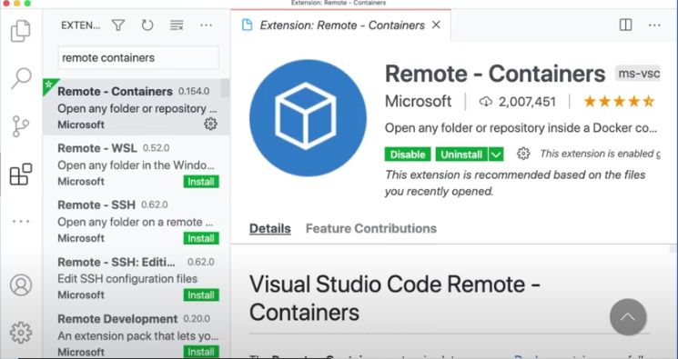
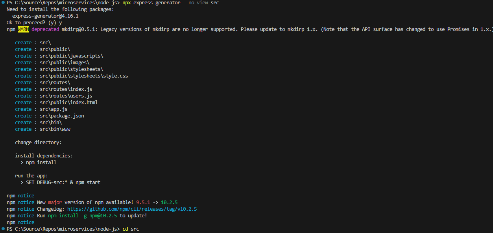
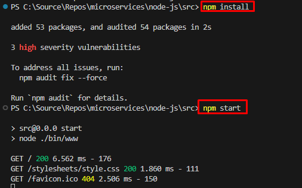
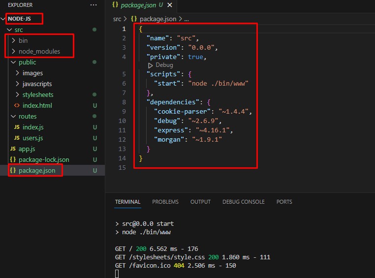

# Local Development Setup with Dev Containers

## Overview

In this lab, I will walk you through the process of setting up a local development environment using Dev Containers. `Dev Containers` provide a consistent and isolated environment for your development projects, ensuring a seamless and uniform experience across team members.

If you're new to Dev Containers and want to learn more about the concept, please visit our website to explore - [What are Development Containers](https://anjikeesari.com/articles/dev-containers-introduction/){:target='_blank'} 


## Objective

In this exercise, our objective is to accomplish and learn the following tasks:

1. [Step 1: Install Docker](#step-1-install-docker)
2. [Step 2: Install the remote - containers extension](#step-2-install-the-remote-containers-extension)
3. [Step 3: Create a new project](#step-3-create-a-new-project)
4. [Step 4: Add Dev Container configuration to a project](#step-4-add-dev-container-configuration-to-a-project)
5. [Step 5: Running a project in a dev container](#step-5-running-a-project-in-a-dev-container)
6. [Step 6: Verify the Setup](#step-6-verify-the-setup)

## Prerequisites

Before we begin, ensure that you have the following prerequisites installed on your machine:

- Visual Studio Code
- (Optional) A Project in Azure DevOps
- (Optional) Git client tool
- Docker (If not installed, refer to "Step 1: Install Docker" below)

## Step 1: Install Docker

If Docker is not already installed on your machine, follow these steps:

1. Visit the [Docker official website](https://www.docker.com/get-started){:target='_blank'}  to download and install Docker for your operating system.
2. Complete the installation process by following the on-screen instructions.
3. Verify the installation by running `docker --version` in your terminal or command prompt.

Verify the docker installation by running following commands:

```sh
docker version
# or
docker --version
# or
docker -v
```


## Step 2: Install the remote containers extension

To work effectively with Dev Containers in Visual Studio Code, you'll need the "Remote - Containers" extension:

Open Visual Studio Code and navigate to the Extensions view by clicking on the Extensions icon in the Activity Bar on the side of the window (or press `Ctrl+Shift+X`). Search for "Remote - Containers" and install the extension provided by Microsoft.

[{:style="border: 1px solid black; border-radius: 10px;"}](images/dev-containers-local-setup-1.png){:target="_blank"}

## Step 3: Create a new project

Now, you can start working on your project. You have the option to create a new project or open an existing one in Visual Studio Code.


In this step, we will set up a new Node.js API project using a basic Express application as our example. To expedite the process, we'll utilize Express's scaffolding tool to generate the necessary directory structure and essential files.


Open your terminal and execute the following commands:

```sh
$ npx express-generator --no-view src
$ cd src
$ npm install
```

npx express-generator:

The npx express-generator command initializes the project, creating a structure that includes directories like 'bin' and 'routes'.

[{:style="border: 1px solid black; border-radius: 10px;"}](images/dev-containers-local-setup-2.png){:target="_blank"}

npm install:

Ensure you run npm install to set up and configure all required Node.js modules.

This step ensures that your project is equipped with the necessary dependencies, allowing seamless integration with Docker and efficient containerization of your Node.js application.

[{:style="border: 1px solid black; border-radius: 10px;"}](images/dev-containers-local-setup-3.png){:target="_blank"}

folder structure

you've established the foundation for your Node.js API project, complete with a standardized directory structure and essential files.

[{:style="border: 1px solid black; border-radius: 10px;"}](images/dev-containers-local-setup-4.png){:target="_blank"}

This should have created a number of files in your directory, including bin and routes directories. Make sure to run npm install so that npm can get all of your Node.js modules set up and ready to use.


## Step 4: Add Dev Container configuration to a project

In the root of your project, create a folder named `.devcontainer` if it doesn't already exist. Inside this folder, create a file named `devcontainer.json`. This file will contain the configuration for your Dev Container.

Here is a basic example for a Node.js project:

```json
// .devcontainer/devcontainer.json
{
  "name": "Node.js Dev Container",
  "image": "node:14",
  "extensions": ["dbaeumer.vscode-eslint"],
  "forwardPorts": [3000],
  "settings": {
    "terminal.integrated.shell.linux": "/bin/bash"
  }
}
```

Adjust the configuration according to your project's requirements and dependencies.


**Sample `docker-compose.yml` for Dev Containers**

Here is an example of a Docker Compose file defining a multi-container application with three services. The application consists of ASP.NET Core API services that depend on a SQL Server database. Docker Compose is utilized to orchestrate the deployment of these three containers.


```yaml
version: '3'

services:
  aspnet-api:
    build:
      context: ../aspnet-api
      dockerfile: ../aspnet-api/Dockerfile
      args:
        - ARG1=value1
        - ARG2=value2
    container_name: aspnet-api-container
    ports:
      - "80:80"
    networks:
      - default
    environment:
      ASPNETCORE_ENVIRONMENT: Production
      API_VERSION: v1
    depends_on:
      - sqlserver-db

  aspnet-app:
    build:
      context: ../aspnet-app
      dockerfile: ../aspnet-app/Dockerfile
      args:
        - ARG1=value3
        - ARG2=value4
    container_name: aspnet-app-container
    ports:
      - "5000:5000"
    networks:
      - default
    environment:
      ASPNETCORE_ENVIRONMENT: Development
      APP_NAME: MyApp
    depends_on:
      - sqlserver-db

  sqlserver-db:
    build:
      context: ../sqlserver-db
      dockerfile: ../sqlserver-db/Dockerfile
    container_name: sqlserver-db-container
    environment:
      SA_PASSWORD: YourStrongPassword
    ports:
      - "1433:1433"
    networks:
      - default
    command: sh -c "sleep 20 && /opt/mssql-tools/bin/sqlcmd -S localhost -U SA -P YourStrongPassword -Q 'CREATE DATABASE YourDatabase'"
```

Explanation:

- The `docker-compose.yml` file describes a multi-container application with three services: `aspnet-api`, `aspnet-app`, and `sqlserver-db`.
- `aspnet-api` and `aspnet-app` are ASP.NET Core applications, each with its own Dockerfile and build arguments.
- `sqlserver-db` is a SQL Server container with a specific command to initialize a database after starting.
- Services are connected to the default network for communication.
- Dependencies are specified using the `depends_on` key, ensuring that services wait for others to start before launching.


## Step 5: Running a project in a dev container

Reopen a project in a container

When you choose to "Reopen in Container" in Visual Studio Code, it triggers the Remote - Containers extension to rebuild and reopen your project within a containerized environment. 

Open the Command Palette (`Ctrl+Shift+P`), type "Reopen in Container," and select the option to rebuild the project inside the Dev Container.


## Step 6: Verify the Setup

Once the container is built and the project is reopened, verify that your development environment is running smoothly inside the Dev Container.

Now that your local development environment is containerized, you can start coding with the confidence that everyone on your team will have a consistent setup.


## Docker compose commands

For more comprehensive details on Docker commands and some commonly used Docker Compose commands, please refer to the [Docker Commands Cheat Sheet](https://anjikeesari.com/developertools/cheatsheets/docker-cheat-sheet/){:target='_blank'} on our website.

## Conclusion

Developing applications inside a Dev Container offers a consistent, isolated, and reproducible development environment, streamlining your development workflow. With Docker and VS Code's Remote - Containers extension, you can quickly set up and manage Dev Containers, ensuring that your team works in agreement with the same development environment. This approach simplifies onboarding, enhances collaboration, and minimizes environment-related issues, allowing you to focus on building application development.

## References

- [Development Containers](https://containers.dev/){:target="_blank"}
- [Use a Docker container](https://learn.microsoft.com/en-us/training/modules/use-docker-container-dev-env-vs-code/){:target="_blank"}
- [Beginner's Series to: Dev Containers](https://www.youtube.com/watch?v=61M2takIKl8){:target="_blank"}
