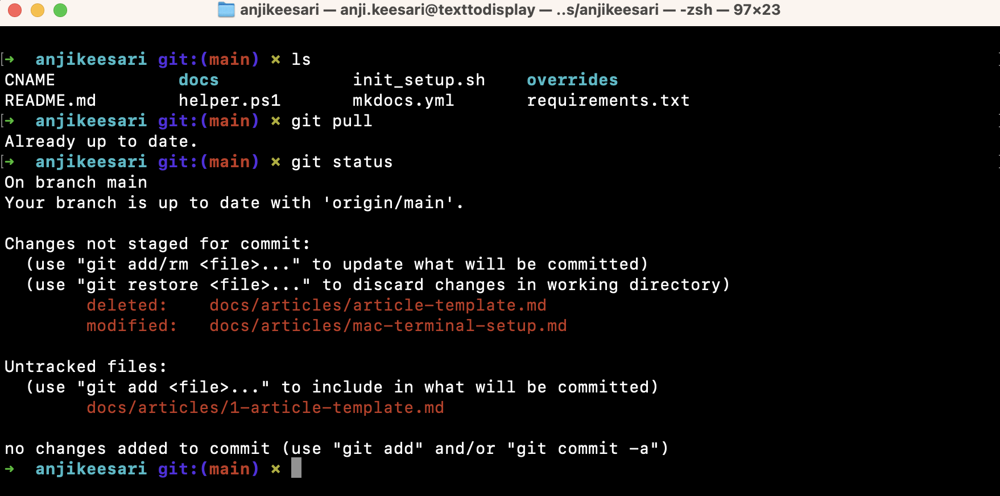

# Setting up Mac Terminal with Oh-My-Zsh

In this tutorial, I'll guide you through the process of customizing your Mac terminal using Oh-My-Zsh. 
`Oh-My-Zsh` is a popular open-source framework for managing Zsh configurations, and it comes with a variety of themes and plugins to enhance your terminal experience.

## Prerequisites

Before we begin, make sure you have the following prerequisites in place:

- A Mac computer running macOS.
- A terminal emulator. or iTerm2

## Step 1: Install Oh-My-Zsh

The first step is to install Oh-My-Zsh. Open your terminal and run the following command:

```shell
sh -c "$(curl -fsSL https://raw.githubusercontent.com/ohmyzsh/ohmyzsh/master/tools/install.sh)"
```

This command will download and install Oh-My-Zsh on your system. Follow the on-screen prompts to complete the installation.

## Step 2: Customize the Theme

Oh-My-Zsh comes with a variety of themes to choose from. To customize your terminal's appearance, open the Zsh configuration file in a text editor. You can use nano, vim, or any text editor you prefer. Here's an example using nano:

```shell
nano ~/.zshrc
# or
open ~/.zshrc
```

Look for the `ZSH_THEME` variable in the configuration file and change it to your desired theme. You can find a list of available themes on the [Oh-My-Zsh Themes GitHub page](https://github.com/ohmyzsh/ohmyzsh/wiki/Themes).

for example:

```sh
ZSH_THEME="aussiegeek"
```

Save your changes and exit the text editor. Your terminal will now display the selected theme.

## Step 3: Install Plugins

Plugins enhance the functionality of your terminal. Oh-My-Zsh has a plugin system that allows you to easily add new features. Let's install two popular plugins: autocomplete and auto-highlighting.

### Autocomplete Plugin

To install the autocomplete plugin, open your terminal and run:

```shell
git clone https://github.com/zsh-users/zsh-autosuggestions ~/.oh-my-zsh/custom/plugins/zsh-autosuggestions
```

Next, add the plugin to your `~/.zshrc` file. Find the `plugins` line and add `'zsh-autosuggestions'` to the list of plugins. It should look like this:

```shell
plugins=(
  # other plugins
  zsh-autosuggestions
)
```

Save your changes and exit.

### Auto-Highlighting Plugin

To install the auto-highlighting plugin, open your terminal and run:

```shell
git clone https://github.com/zsh-users/zsh-syntax-highlighting.git ~/.oh-my-zsh/custom/plugins/zsh-syntax-highlighting
```

Now, add this plugin to your `~/.zshrc` file in the same way you added the autocomplete plugin:

```shell
plugins=(
  # other plugins
  zsh-syntax-highlighting
)
```

Save and exit the file.

## Step 4: Enable the Plugins

To enable the newly installed plugins, open your `~/.zshrc` file once again and make sure the `plugins` section looks like the following:

```shell
plugins=(
  # other plugins
  git
  zsh-autosuggestions
  zsh-syntax-highlighting
  zsh-completions
)
```

Save your changes and exit the file.

## Step 5: Restart Your Terminal

To apply the changes, close and reopen your terminal, or run the following command:

```shell
source ~/.zshrc

# or
omz reload 
```

Your Mac terminal is now set up with Oh-My-Zsh, and you've customized it with your chosen theme and plugins. Enjoy your enhanced terminal experience!

Feel free to explore more themes and plugins to further enhance your productivity and style in the terminal.

If everything is setup properly then your terminal output will look like this.

[{:style="border: 1px solid black; border-radius: 10px;"}](images/mac-terminal-setup-1.png){:target="_blank"}


## Resources

- [Oh-My-Zsh Official Website](https://ohmyz.sh)
- [Oh-My-Zsh Themes](https://github.com/ohmyzsh/ohmyzsh/wiki/Themes)

