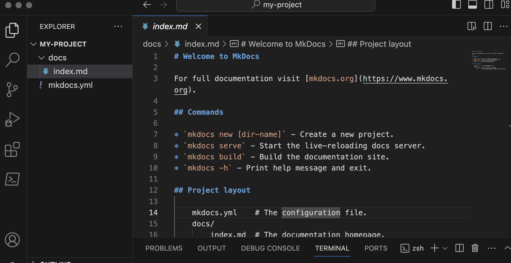
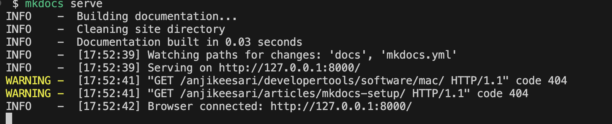
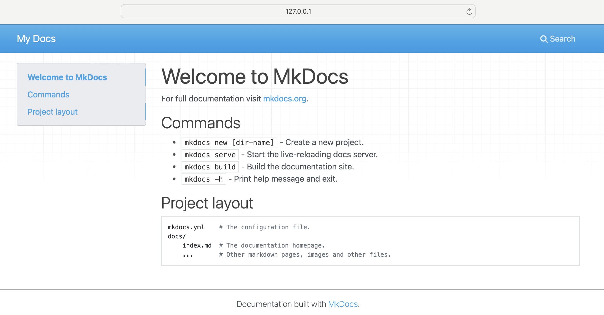
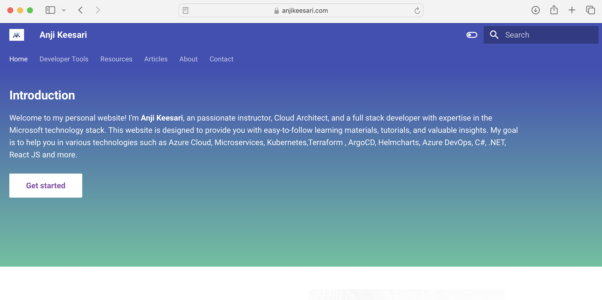

# Create a Website Using Material for MkDocs: A Step-by-Step Guide

<!-- ## Table of Contents

1. [Introduction to Material for MkDocs](#introduction-to-material-for-mkdocs)
2. [Prerequisites](#prerequisites)
3. [Step 1: Installation](#step-1-installation)
4. [Step 2: Creating Your Project](#step-2-creating-your-project)
5. [Step 3: Run the Project Locally](#step-3-run-the-project-locally)
6. [Step 4: Add Content & Configure the Website](#step-4-add-content--configure-the-website)
7. [Step 6: Building and Deploying Your Site](#step-6-building-and-deploying-your-site)
8. [Step 7: Customization Home Page](#step-7-customization-home-page)
9. [Conclusion](#conclusion)
10. [References](#references) -->


## Introduction to Material for MkDocs,

Material for MkDocs, a static site generator written in Python, simplifies the process of creating project documentation. it helps for IT professionals, developers, and writers for creating a website. Static websites are fast, secure, and easy to maintain, making them an ideal choice for documentation, blogs, and personal websites. 

In this article, I will guide you through the steps by step instructions on how to create a static website or documentation site using Material for MkDocs, an extension of the MKDocs project that brings a modern look and additional features to your site.


## Prerequisites

- Basic knowledge of Python and Markdown.
- Access to a command-line interface.

## Step 1: Installation

**Install Homebrew** (macOS users):

```bash
/bin/bash -c "$(curl -fsSL https://raw.githubusercontent.com/Homebrew/install/HEAD/install.sh)"
```

**Install Python 3:**

MkDocs requires a recent version of `Python` and the Python package manager, `pip`, to be installed on your system.


```bash
brew install python3

# verify the installation
python3 --version
```

(or use the respective command for your operating system).

**Upgrade PIP:**

```bash
pip3 install --upgrade pip
```

This ensures you have the latest version of PIP.

**Install MKDocs** and Related Packages:

```bash
pip3 install mkdocs
pip3 install mkdocs-material
pip3 install mkdocs-material-extensions
```

These commands install MKDocs, the Material theme, and additional extensions.

## Step 2: Creating Your Project

Initialize Your MKDocs Project:

```bash
mkdocs new my-project
```

output
```sh
INFO    -  Creating project directory: my-project
INFO    -  Writing config file: my-project/mkdocs.yml
INFO    -  Writing initial docs: my-project/docs/index.md
```

Replace 'my-project' with your project name. This command creates a new directory with essential configuration files.

Navigate to Your Project Directory:

```bash
cd my-project
```

Open the project in VS code

```sh
code .
```

[{:style="border: 1px solid black; border-radius: 10px;"}](images/mkdocs-setup-1.png){:target="_blank"}

## Step 3: Run the Project Locally

MkDocs comes with a `built-in dev-server` that lets you preview your documentation as you work on it. Make sure you're in the same directory as the `mkdocs.yml` configuration file, and then start the server by running the `mkdocs serve` command:

```sh
mkdocs serve
```
[{:style="border: 1px solid black; border-radius: 10px;"}](images/mkdocs-setup-2.png){:target="_blank"}

This command starts a local server. Access your site at <http://127.0.0.1:8000> and see changes in real-time as you edit your documents.

[{:style="border: 1px solid black; border-radius: 10px;"}](images/mkdocs-setup-3.png){:target="_blank"}

The server automatically rebuilds your site when you save changes, allowing you to see updates in real-time.

## Step 4: Add Content & Configure the Website

MKDocs organizes content using Markdown files in the `docs` directory. The `index.md` file is the homepage of your website.

**Create Markdown Files**:

Write your content in Markdown format. You can create multiple files and organize them into directories as needed.


**Customization and Extensions**


Material for MkDocs supports extensive customization. Edit your `mkdocs.yml` to include features like a search bar, social media links, or Google Analytics. MkDocs also supports plugins, which can add functionalities like search engine optimization, PDF export, and more.

**Configure the Website**

Editing `mkdocs.yml` customizes your website’s structure. Define your site name, theme (Material), and navigation structure. 

Here’s a basic example:

```sh
site_name: My Awesome Project
theme: 
  name: material
nav:
  - Home: index.md
  - About: about.md
```

Explore the [Material for MkDocs documentation](https://squidfunk.github.io/mkdocs-material/){:target="_blank"} for customization options and add them to your `mkdocs.yml`.

## Step 5: Building and Deploying Your Site

**Build Your Site**:

When you're ready to publish, build a static site with:

```bash
mkdocs build
```

This command compiles your Markdown files into a static HTML website in the `site` directory.

This creates a `site` directory with your website’s static HTML files. For deployment, you can upload these files to a web server or use services like [GitHub Pages](https://pages.github.com/) for hosting. MkDocs provides a simple command for deploying to GitHub Pages:

```bash
mkdocs gh-deploy
```

 **Deploy Your Site**:

Choose a hosting solution (e.g., GitHub Pages, GitLab Pages or any other hosting solution) and follow their instructions to deploy your MKDocs site.

## Step 6: Customization Home Page

Your home page is the first thing visitors see. Make it informative and engaging. Edit the `index.md` file in the `docs` folder to add content. 

This is the file you are looking for: `overrides/home.html`. You'll want to copy it over to your own overrides directory. Make sure you've set your custom_dir in `mkdocs.yml`:

```sh
theme:
  custom_dir: docs/overrides
...
```

In the front matter of your `index.md`, you need to specify the template to use:

```sh
---
title: Title
template: home.html
---


```

!!!note
    One important thing that took me a while to realize: you need a newline at the end of your md file. If you don't have one, the content will not display. I guess it's processed as having null content if you don't include the newline.

[{:style="border: 1px solid black; border-radius: 10px;"}](images/mkdocs-setup-4.png){:target="_blank"}


## Conclusion

Material for MkDocs is an excellent tool for IT professionals and tech writers to create and maintain documentation websites. With its easy-to-use features and extensive customization options, it's an ideal choice for documenting software project documentation, writing online e-Book, and more.

## References

- [Material for MkDocs](https://squidfunk.github.io/mkdocs-material/){:target="_blank"}
- [MkDocs ](https://www.mkdocs.org/#installation){:target="_blank"}
- [Getting Started with MkDocs](https://www.mkdocs.org/getting-started/){:target="_blank"}
<!--
- [How to create beautiful documentation](https://www.youtube.com/watch?v=OOxL-r1L334&t=609s){:target="_blank"}
- [UP42 Python SDK](https://sdk.up42.com){:target="_blank"}
- [How To Create STUNNING Code Documentation With MkDocs Material Theme](https://www.youtube.com/watch?v=Q-YA_dA8C20){:target="_blank"} 
-->