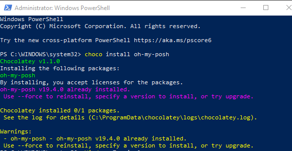
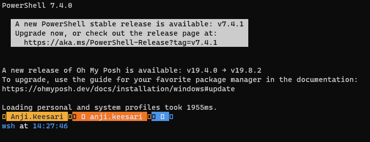
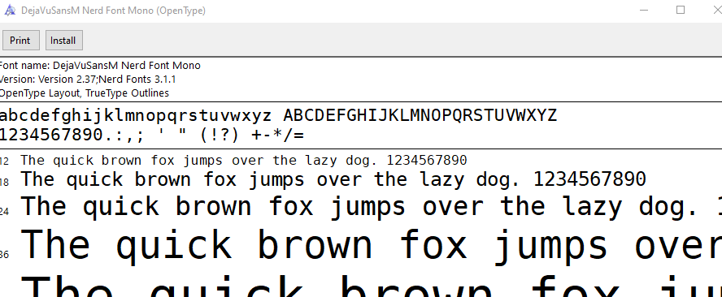
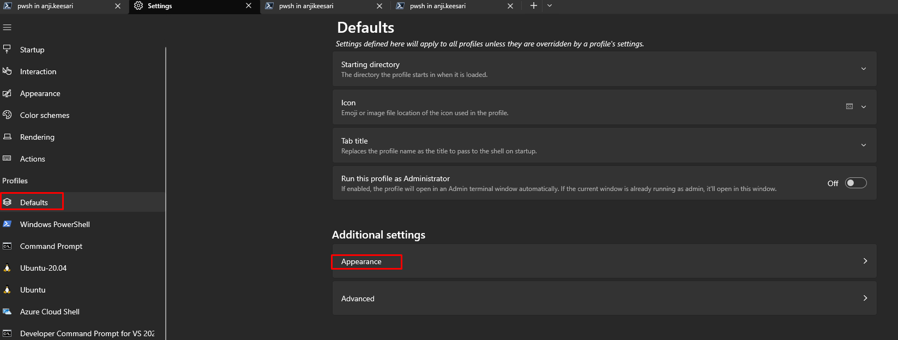
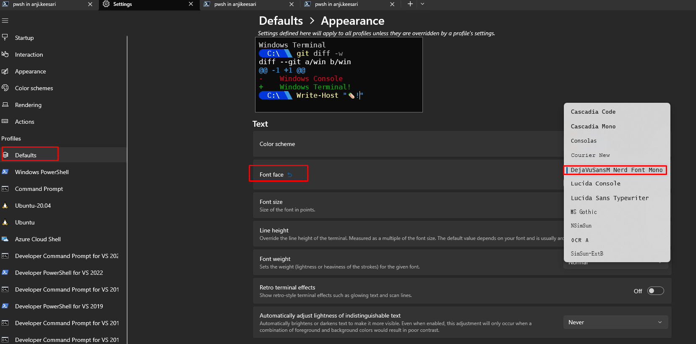
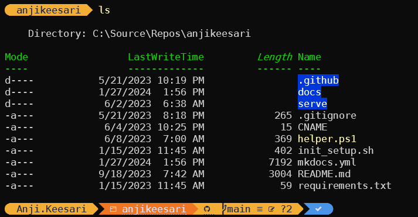

# Setting up Windows Terminal with Oh-My-Posh

In this tutorial, I'll guide you through the process of customizing your Windows terminal using Oh-My-Posh. 

`Oh My Posh` is a highly customizable prompt engine designed to elevate your command-line experience. With full support for colors, it allow users to create visually appealing and informative prompts in various shell environments.

## Prerequisites

Before we begin, make sure you have the following prerequisites in place:

- Windows 10 or later
- [PowerShell](https://learn.microsoft.com/en-us/powershell/scripting/install/installing-powershell-on-windows?view=powershell-7.4){:target="_blank"} - make sure latest version is installed
- [Chocolatey](../developertools/software/windows.md#install-chocolatey){:target="_blank"}
- A [Windows Terminal](../developertools/software/windows.md#windows-terminal){:target="_blank"}


## Step 1: Install Windows Terminal

If you haven't already installed Windows Terminal, you can install from choco tool or get it from the Microsoft Store

Microsoft Store:

   - Open the Microsoft Store.
   - Search for "Windows Terminal" and click on the application's page.
   - Click the "Get" or "Install" button to download and install it.

Once Windows Terminal is installed, you can open it by searching for "Windows Terminal" in the Windows Start menu.

## Step 2: Install Oh-My-Posh

Open your terminal and run the following command:

```shell
choco install oh-my-posh
```

[{:style="border: 1px solid black; border-radius: 10px;"}](images/oh-my-posh-1.png){:target="_blank"}


This command will download and install Oh-My-Posh on your system. 


## Step 3: Configure Oh My Posh

Once Oh-My-Posh is installed, you can configure your PowerShell prompt to use a custom theme. To configure your prompt, follow these steps:

Open your PowerShell profile for editing

```sh
code $profile
# or
notepad.exe $PROFILE
```

file will be empty initially, insert following

```shell
oh-my-posh.exe init pwsh | Invoke-Expression
```

Save and close your profile

<!-- oh-my-posh.exe init pwsh --config ".\clean-detailed.omp.json" | Invoke-Expression -->

 open a new Windows Terminal instance to see the updated prompt with your chosen theme.

[{:style="border: 1px solid black; border-radius: 10px;"}](images/oh-my-posh-2.png){:target="_blank"}

## Step 4: Install Nerd Font
Nerd Fonts are specialized fonts that include a wide range of icons and symbols commonly used in programming and terminal applications. These fonts are popular among developers and users who want to enhance their terminal experience. Here are the steps to install a Nerd Font on your system:


- **Choose a Nerd Font**: Before you can install a Nerd Font, you need to decide which Nerd Font variant you want to use.You can find a list of available Nerd Fonts on the [Nerd Fonts GitHub repository](https://github.com/ryanoasis/nerd-fonts). `DejaVu Sans Mono Nerd Font` - is my favorite

- **Download the Nerd Font**: Visit the following webstie to download your chosen of Nerd Font. <https://www.nerdfonts.com/font-downloads>

- **Install the Nerd Font**: Once you have downloaded the Nerd Font, click on `install` button to install it on your Windows system:
     [{:style="border: 1px solid black; border-radius: 10px;"}](images/oh-my-posh-2.1.png){:target="_blank"}


4. **Configure Windows Terminal to Use the Nerd Font**: To use the Nerd Font in Windows Terminal, you'll need to configure your terminal settings. Here's how to do it:
    
    [{:style="border: 1px solid black; border-radius: 10px;"}](images/oh-my-posh-2.2.png){:target="_blank"}
    
    [{:style="border: 1px solid black; border-radius: 10px;"}](images/oh-my-posh-2.3.png){:target="_blank"}

To apply the changes, close and reopen Windows Terminal. 

## Step 5: Verify the Oh My Posh Install

To verify that Oh-My-Posh is correctly installed and configured, open Windows Terminal and ensure that you see your custom prompt with the selected theme. You should see a stylish and informative prompt that includes Git status, time, and other relevant information.

Now, You've successfully set up Windows Terminal with Oh-My-Posh, enhancing your command-line experience on Windows.

[{:style="border: 1px solid black; border-radius: 10px;"}](images/oh-my-posh-3.png){:target="_blank"}

## Conclusion

By following these steps, you've successfully set up Windows Terminal with Oh-My-Posh and a Nerd Font. You now have a highly customizable and visually appealing terminal environment on your Windows system, perfect for coding and everyday tasks.

Feel free to explore different Oh-My-Posh themes and Nerd Font variants to personalize your terminal even further.

## Resources

- [Oh My Posh - Official Website](https://ohmyposh.dev/){:target="_blank"}
- [Nerd Fonts](https://www.nerdfonts.com/){:target="_blank"}
- [microsoft/terminal](https://github.com/microsoft/terminal){:target="_blank"}
- [Installation](https://gist.github.com/royz/e9a58f794f88ed8f601cbf39530c2936){:target="_blank"}
<!-- - [Getting Started with oh-my-posh in PowerShell and Windows Terminal](https://www.youtube.com/watch?v=OL9Mr4dzIWU){:target="_blank"} -->