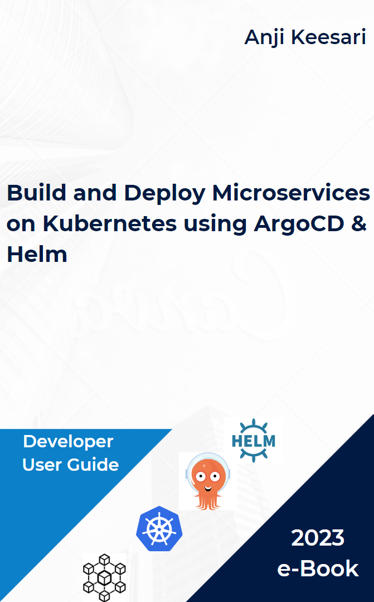

# Welcome to my personal website!

## Introduction

Hello! I'm **Anji Keesari**, an passionate instructor, Cloud Architect, and a full stack developer with expertise in the Microsoft technology stack. This website is designed to provide you with easy-to-follow learning materials, tutorials, and valuable insights. My goal is to help you in various technologies such as Azure Cloud, Microservices, Kubernetes,Terraform , ArgoCD, Helmcharts, Azure DevOps, C#, .NET, React JS and more.

## e-Book

Welcome to my eBook, `Build & Deploy Microservices on Kubernetes using ArgoCD & Helm`. In this book, I'm going to share my practical knowledge about creating and managing microservices applications in Kubernetes using the latest tools like ArgoCD and Helm.

!!! note
    This book is still a work in progress, However, you are still welcome to continue reading what has been written so far.

<!-- 
## Learning Approach

When it comes to teaching these technologies, I believe in a practical and hands-on approach. I focus on providing real-world examples and interactive exercises to help you truly understand and master these technologies. In each course and tutorial, you'll find clear explanations, code samples, and step-by-step instructions. This way, you can easily grasp the concepts and learn how to apply them in real-life situations.

## Additional Resources

In addition to the courses, you will find a range of resources on this website to support your learning journey:

- **Blog:** Regularly updated blog posts covering various technologies, best practices, and industry insights.
- **Code Examples:** A repository of code examples demonstrating key concepts and techniques with real-life examples.
- **Recommended Tools:** List of tools, frameworks, and libraries that can enhance your productivity and development experience.

## Get Started

Are you ready to begin your learning journey? Start exploring the courses and tutorials today! If you have any questions or need assistance, don't hesitate to reach out using the provided contact information. -->

