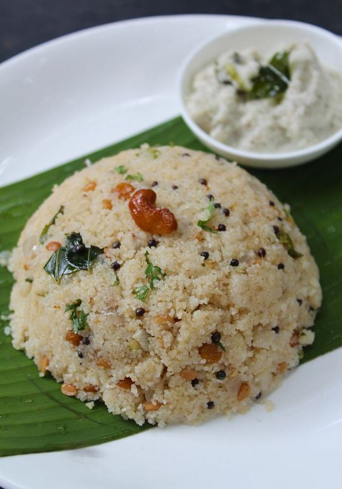
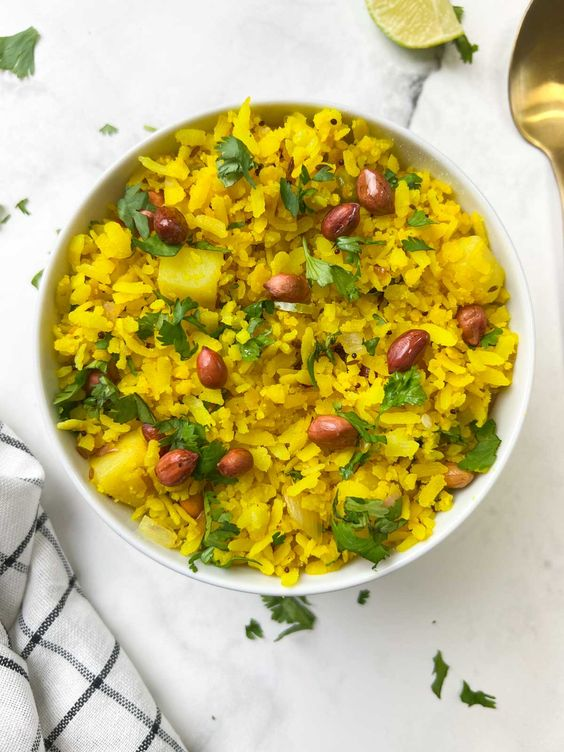
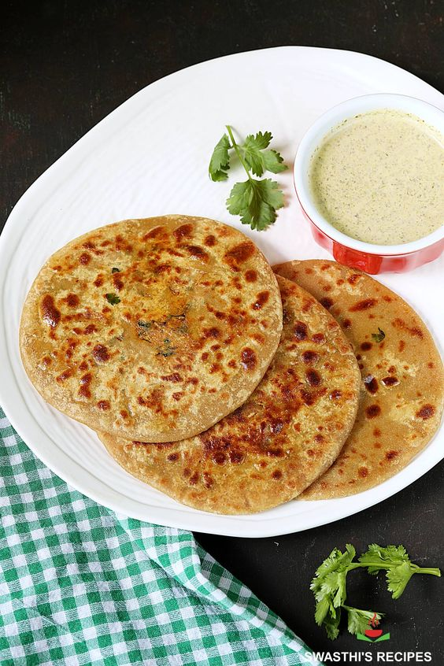

# Breakfast Recipes

## Upma Recipe

[{ align=right width=400 height=350;}](images/image-3.png){:target="_blank"}

Upma! Basic and popular South Indian Breakfast Recipe which is loved by everyone.

**Ingredients**

- 2 cup Rava | suji or semolina flour
- 1/2 tsp Asafoetida
- 5 piece Beans
- 1 Carrot, medium
- 4 Chili pepper, Green
- 2 tbsp Coriander
- 2 tsp Ginger
- 2 Onion, medium
- 1 tsp Lemon juice
- 2 Salt,- 1 tsp Turmeric, Powder
- 5 tbsp Vegetable oil
- 1 cup Milk
- 10 piece Cashews, - 1 tsp Split Urad dal

**Reference:**
- [indianhealthyrecipes:](https://www.indianhealthyrecipes.com/mooli-paratha/){:target="_blank"}

## Poha Recipe

[{ align=right width=400 height=350;}](images/image-2.png){:target="_blank"}

Poha is a most popular breakfast or snack recipe made with flattened rice (poha), onions, roasted peanuts, and a few spices.

**Ingredients**

- 2 tbsp Coriander, leaves
- 2 Green chilies
- 1 Onion ((about 3/4 cup), medium
- 2 tbsp Peanuts
- 1 Potato, medium
- 1 tbsp Lemon juice
- 1/2 tsp Mustard seeds
- 1 Salt
- 1/2 tsp Sugar
- 1/2 tsp Turmeric
- 2 tbsp Oil
- 1 sprig Curry, leaves

**Reference:**
- [indianhealthyrecipes:](https://www.indianhealthyrecipes.com/mooli-paratha/){:target="_blank"}

## Uttapam Recipe

[{ align=right width=400 height=350;}](images/image-4.png){:target="_blank"}

vegetable uttapam recipe | veg uttapam | mixed veggie uttapa

**Ingredients**

- 1 Carrot
- 1 Chilli
- 2 tbsp Coriander
- 1 inch Ginger
- 1 Onion
- 2 cup Idli rice
- 1 cup Poha / aval / flattened rice, thin
- 1/2 tsp Methi / fenugreek
- 2 1/4 tsp Salt
- 1 Oil
- 3 Curry, leaves
- 1 Water (for soaking & grinding)
- ½ capsicum (finely chopped)
- 1 To mato (finely chopped)
- ½ cup urad dal

**Reference:**
- [Pintrest:](https://www.pinterest.com/pin/294282156909039846/){:target="_blank"}

## Mooli Paratha

[{ align=right width=400 height=350;}](images/image-1.png){:target="_blank"}

Make delicious and healthy stuffed mooli parathas with this easy recipe. They go well with yogurt, pickle or a chutney. 

**Ingredients**

   - 3 tbsp Coriander, fine leaves
   - 1/2 inch Ginger
   - 1 Green chilies
   - 4 cups Radish
   - 1/2 tsp Garam masala
   - 1/3 tsp Kashmiri red chili powder
   - 1/2 tsp Salt
   - 1/8 tsp Turmeric
   - 2 cups Wheat flour

**Reference:**
- [indianhealthyrecipes:](https://www.indianhealthyrecipes.com/mooli-paratha/){:target="_blank"}

