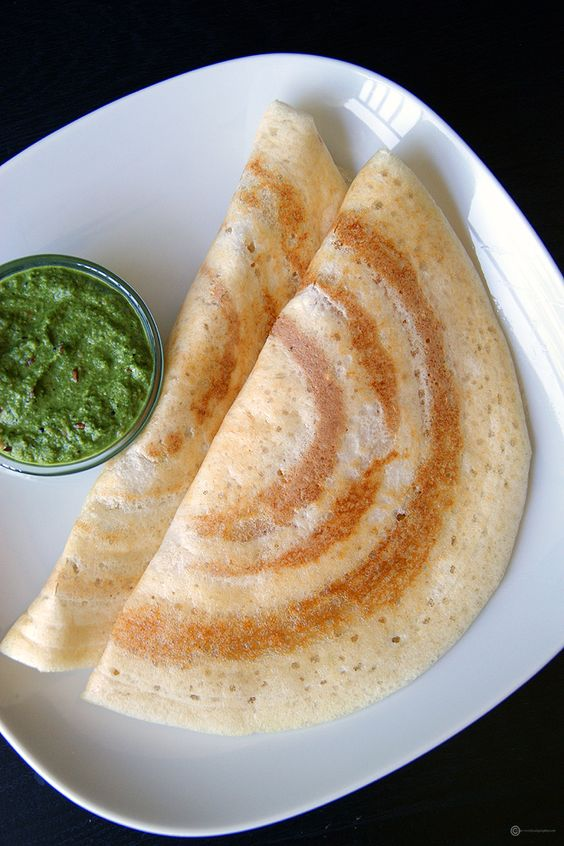
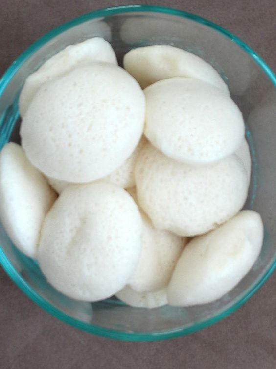

# Dinner Recipes

## Dosa Recipe

[{ align=right width=400 height=350;}](images/image-5.jpg){:target="_blank"}

Dosa is a traditional South Indian crepe/pancake made from fermented rice and dal batter. 

**Ingredients**

- 3 cups Idli rice
- 1 1/2 tsp Fenugreek seeds
- 2 tsp Salt
- 1 Water
- 3/4 Cup Poha
- 1 Cup Urad dal

**Reference:**
- [Pintrest:](https://www.pinterest.com/pin/292030357070795707/){:target="_blank"}

## Idli Recipe

[{ align=right width=400 height=350;}](images/image-10.jpg){:target="_blank"}

**Ingredients**

- 2 cup Idli rice or sona masuri rice
- 1 cup Poha / aval / avalakki / flattened rice, thick
- 1 tsp Salt
- 1 Oil
- 1 Water
- 1 cup Urad dal

**Reference:**
- [indianhealthyrecipes:](https://www.indianhealthyrecipes.com/mooli-paratha/){:target="_blank"}

