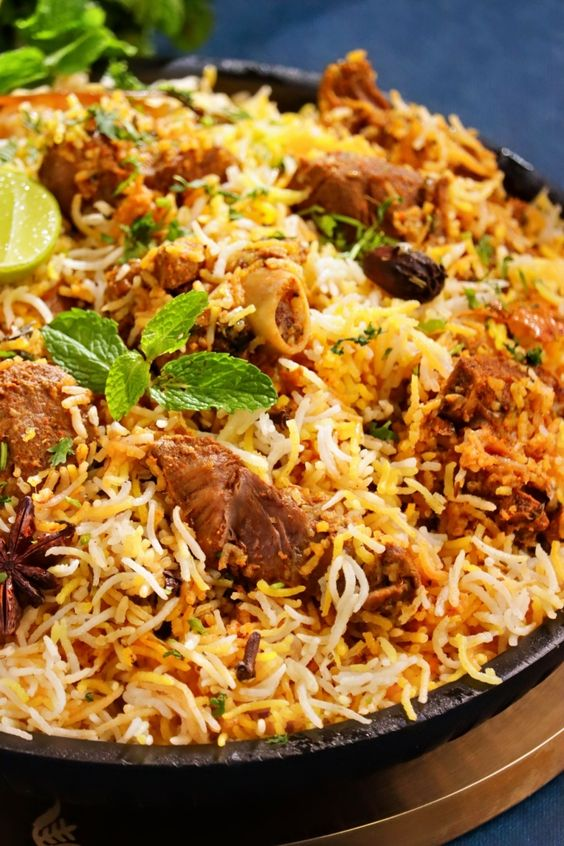
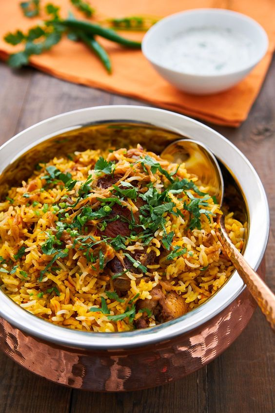
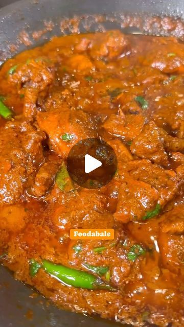
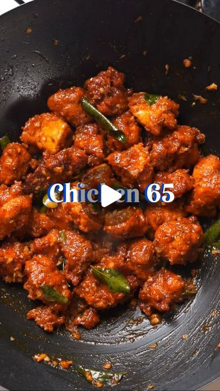

# **Lunch Recipes**

## **Hyderabad Bawarchi Style Mutton Dum Biryani**

[{ align=right width=400 height=350;}](images/image-6.jpg){:target="_blank"}

The Special Hyderabadi Mutton Dum Biryani 

**Ingredients**

- Marinate meat
- 1 Chillies, Green
- 1 Coriander, Powder
- 2 Coriander small bunch, Green
- 1 Juice of a lemon
- 1 Mint - small bunch
- 3 Onions, Medium Size
- 1 Onions, Fried Half
- 1 Curd
- 1 Ginger garlic paste
- 1 Basmati rice
- 1 Cardamoms, Black
- 2 Cinnamon
- 2 Clove
- 2 Garam masala
- 2 Salt
- 1 Turmeric
- 1 Oil
- 1 Cumin, Roasted Powder
- 2 Cumin, Black
- 2 Ghee
- 2 Saffron milk
- 2 Biryani, leaves
- Mirchi

**Reference:**
- [Pintrest](https://www.pinterest.com/pin/639933428329840745/){:target="_blank"}

## **Hyderabad Chicken Dum Biryani**

[{ align=right width=400 height=350;}](images/image-7.jpg){:target="_blank"}

The Special Hyderabadi Mutton Dum Biryani 

**Ingredients**

- 1 Chicken
- 1 Chilli, Red Powder
- 1 Chillies, Green
- 1 Coriander, Roasted Powder
- 2 Coriander, Green
- 2 Lemons, Juice 
- 1 Little green coriander
- 1 Mint, leaves
- 1 Oil from fried onions
- 1 Oil used to fry onions
- 2 Onions, Big fried
- 1 Onions, Fried
- 1 Curd
- 2 Ginger garlic spread
- 1 Maida flour paste
- 1 Basmati rice
- 2 Cardamom
- 1 Cardamom, Powder
- 2 Cinnamon
- 2 Clove
- 2 Garam masala
- 2 Mace
- 1 Saffron
- 3 Salt
- 1 Star anise
- 2 Cumin, Black
- 1 Cumin, Roasted Powder
- 2 Ghee
- 1 Milk cream
- 1 Biryani, Leaf

**Reference:**
- [Pintrest](https://www.pinterest.com/pin/27443878972151127/){:target="_blank"}

## **Chicken Curry**

[{ align=right width=400 height=350;}](images/image-8.jpg){:target="_blank"}

The Special Hyderabadi Chicken curry recipe 

**Ingredients**

- 500 g Chicken, bone-in
- 1 tsp Coriander, powder
- 3 Onions, medium size
- 3 Tomato puree, fresh medium size
- 1 tbsp Ginger-garlic paste or adrak lahsun paste
- 2 cup Water adjust as per gravy need
- 1 tsp Black pepper, powder
- 2 tsp Fenugreek leaves or kasuri methi., dry
- 2 tsp Garam masala, powder
- 2 tsp Red chili powder
- 1 1/2 tsp Salt adjust as per need
- 1/2 tsp Turmeric or haldi, powder
- 2 tsp Lemon juice or vinegar
- 5 tbsp Vegetable oil
- 1 tbsp Cumin seed
- 8 Water soaked cashew nut .optional, hot
- 1 Bay leaf or tej patta
- 4 5 green cardamon or elaichi
- 2 inch Cinnamon or dalchini
- 4 5 cloves or laungh
- 2 tbsp Finely chopped coriander leaves or dhania patta
- 3 Vertically sliced green chilli

**Reference:**
- [Pintrest](https://www.pinterest.com/pin/639933428329840745/){:target="_blank"}

## **Chicken 65**

[{ align=right width=400 height=350;}](images/image-9.jpg){:target="_blank"}

The Special Chicken 65 

**Ingredients**

- 1 3/4 lbs Chicken thighs
- 2 Green chilis
- 2 1/2 tbsp Ginger garlic spread
- 1/4 tsp Black pepper
- 2 1/2 tbsp Corn starch
- 1/4 tsp Garam masala
- 2 1/3 tbsp Kashmiri chili powder
- 3 tbsp Rice flour
- 1/2 tsp Salt
- 1/8 tsp Turmeric
- 1 Neutral oil
- 1 tbsp Olive oil
- 1/2 tsp Cumin, powder
- 2 sprig Curry, leaves
- 1/4 cup Dahi

**Reference:**
- [Pintrest](https://www.pinterest.com/pin/639933428329840745/){:target="_blank"}

