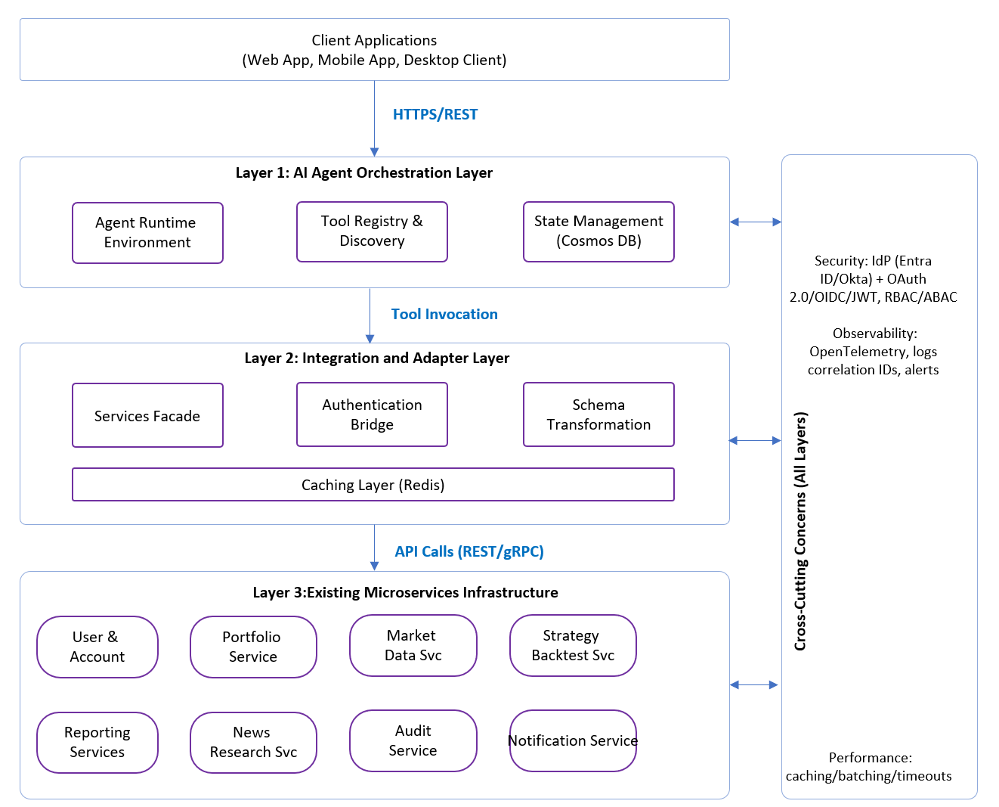
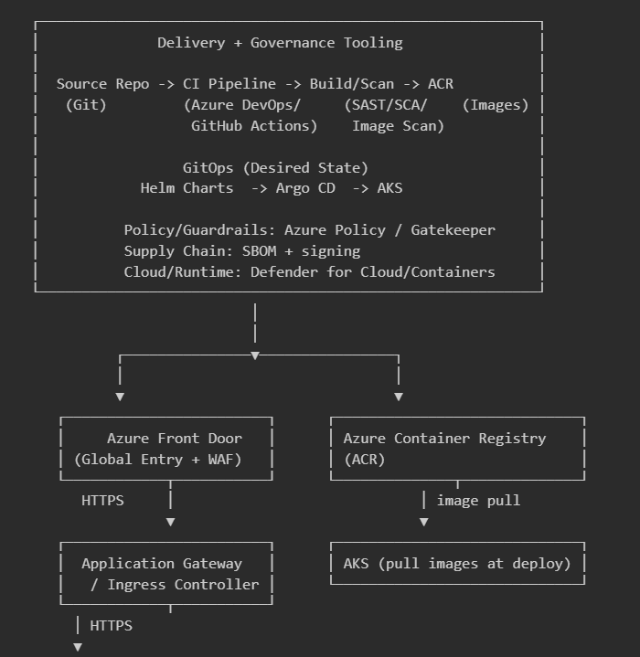

---
hide:
  - navigation
---

# Integrating AI Agent Frameworks with Existing Microservices: An Adapter-Based Architecture for Enterprises

## Authors
Anji Keesari  
Cloud Architect   
San Ramon, California, USA  
Email: anjkeesari@gmail.com

## Abstract

Enterprises face a critical challenge integrating AI agent technologies into established microservices architectures without disrupting operations. Organizations in regulated industries have invested substantially in microservices infrastructure that cannot be easily replaced. This paper presents an architectural framework enabling AI agent integration with existing microservices ecosystems through evolutionary rather than revolutionary modernization.

This paper proposes a hybrid three-layer architecture introducing an agent orchestration layer that interacts with microservices through standardized adapter patterns and API gateway integration. The framework addresses enterprise requirements including authentication propagation, distributed tracing, security compliance, and performance optimization while supporting multiple agent platforms and maintaining backward compatibility with existing services.

Unlike prior work that focuses primarily on agent runtimes or LLM-to-tool interfaces, this paper targets brownfield enterprise integration: integrating agents into existing microservices while preserving established security, observability, and operational controls.

Key contributions include the three-layer integration architecture, a reusable pattern catalog with implementation guidance, and an anonymized, production-inspired case study (TradeSignal, a market-data-driven “trading research assistant” integrating an agent layer with a microservices backend) with an evaluation methodology.

**Index Terms**—AI agents, microservices architecture, enterprise integration, large language models, API gateway, distributed systems, RESTful services, authentication propagation, tool calling, Model Context Protocol, LangChain, Semantic Kernel, financial services, software architecture patterns.

---

## 1. Introduction

### 1.1 Background and Motivation

Microservices architectures have become the standard for enterprise distributed systems, with organizations investing substantially in these infrastructures to power critical business operations. Concurrently, large language models (LLMs) and AI agent frameworks offer unprecedented opportunities for intelligent automation. AI agents—autonomous systems capable of reasoning, planning, and executing complex tasks through tool use—can interpret natural language instructions, make contextual decisions, and orchestrate multiple services to accomplish high-level objectives.

However, enterprises face a critical challenge: existing microservices infrastructures represent substantial investments that cannot be abandoned, yet AI agent frameworks are designed for greenfield development. This disconnect creates barriers to AI adoption, especially in regulated industries where system stability, security, and compliance are paramount. Organizations need practical approaches enabling evolutionary modernization rather than complete system replacement.

Regulated industries exemplify this challenge. Financial services platforms, healthcare systems, and government infrastructures rely on mature microservices ecosystems handling sensitive data under strict compliance requirements (SOC 2, PCI DSS, HIPAA). Introducing AI agents requires architectural planning ensuring security, reliability, and regulatory compliance.

This paper addresses these challenges through a hybrid architectural framework enabling evolutionary integration of AI agents with existing microservices.

### 1.2 Problem Statement

Integrating AI agent frameworks with existing microservices architectures presents significant challenges that current research and industry practices have not adequately addressed:

**Architectural Incompatibility**: Traditional microservices communicate through synchronous REST calls or message queues with well-defined contracts. AI agents operate through dynamic tool calling, where the runtime determines function invocation based on natural language reasoning. This fundamental difference creates integration challenges that standard API gateways cannot fully resolve.

**Security and Compliance**: Enterprise API ecosystems implement sophisticated security models (OAuth 2.0, JSON Web Tokens (JWTs), role-based access control (RBAC), and attribute-based access control (ABAC)). AI agents must respect these boundaries while orchestrating calls across multiple services with different authentication requirements. Current frameworks provide limited guidance on enterprise security integration, authentication propagation, and audit logging required for regulatory compliance.

**Performance Optimization**: REST APIs require low-latency responses with strict service-level agreements (SLAs) (e.g., sub-100 ms for critical operations in latency-sensitive domains). AI agents add computational overhead from LLM inference, tool selection, and multi-step reasoning. Organizations need architectural patterns minimizing latency impact while maintaining intelligence benefits, including strategies for caching, request batching, and hybrid execution models.

**Observability and Schema Management**: Traditional distributed tracing tools are designed for request-response patterns, not complex agent decision trees with multiple tool invocations. Additionally, bridging strongly-typed microservice schemas (OpenAPI, Protocol Buffers) with natural language agent interactions requires systematic approaches to schema translation, validation, and error handling.

These interconnected challenges require a comprehensive architectural framework addressing them holistically while maintaining compatibility with existing systems.

### 1.3 Research Objectives

This research develops a practical architectural framework for integrating AI agents with existing microservices in enterprise environments. Specific objectives include: (1) designing a comprehensive framework supporting multiple agent platforms while preserving security, performance, and compliance; (2) identifying reusable design patterns with concrete implementation guidance; (3) developing optimization strategies for latency, security, and observability; and (4) providing systematic implementation guidance enabling organizations to adopt AI agents while maintaining compatibility with existing infrastructure.

### 1.4 Contributions

This paper contributes: (1) a three-layer, adapter-based architectural framework enabling non-invasive AI agent integration with existing microservices; (2) seven reusable design patterns with implementation guidance and trade-off analysis addressing authentication propagation, tool registry management, caching strategies, and hybrid orchestration; (3) a systematic implementation approach covering framework selection, automated tool generation from OpenAPI specifications, enterprise security integration, and observability integration; (4) architectural principles supporting evolutionary adoption while preserving existing security models and compliance constraints; and (5) an anonymized, production-inspired case study (TradeSignal, a market-data-driven “trading research assistant” integrating an agent layer with a microservices backend) plus evaluation methodology to validate feasibility and quantify latency/cost/correctness trade-offs.

### 1.5 Scope and Methodology

This paper is an architecture and design-pattern contribution grounded in enterprise microservices constraints. We assume existing services expose well-defined APIs (e.g., REST, gRPC) with established authentication and authorization controls, and we focus on integration mechanisms that do not require microservice modification. The scope is the agent-to-microservice integration boundary (tool modeling, adapters/facades, authentication propagation, schema translation, and observability). We do not propose new learning algorithms or LLM architectures; instead, we provide a framework-agnostic integration approach intended to be implemented with multiple agent platforms.

---

## 2. Related Work

This paper builds upon and extends research in three interconnected areas: microservices architecture patterns, AI agent frameworks, and enterprise AI integration strategies. It reviews key contributions in each area and identifies gaps that our framework addresses.

### 2.1 Microservices Architecture and API Management

Foundational work by Newman [1] and Richardson [2] established microservices design principles and pattern languages, focusing primarily on greenfield system design rather than integration with new capabilities. API gateways [3,4] and service meshes (Istio [5], Linkerd [6]) provide sophisticated infrastructure for service communication but are designed for traditional request-response patterns with predefined endpoints. They lack semantic understanding of dynamic, reasoning-based invocation required by AI agents.

OpenAPI specifications [7] enable automated API documentation and client generation but assume static, programmatic consumption. This paper extends these concepts by automatically generating agent tool definitions from OpenAPI specifications, bridging structured API contracts with natural language agent interfaces—a gap not addressed by existing API management solutions.

### 2.2 AI Agent Frameworks and Orchestration

Modern agent frameworks including LangChain [8], AutoGen [9], Semantic Kernel [10], and LangGraph [12] provide abstractions for tool orchestration and multi-step reasoning. LangChain pioneered agent-tool interaction patterns but assumes simple integration scenarios. AutoGen advances multi-agent coordination but targets research scenarios. Microsoft's enterprise frameworks (e.g., Semantic Kernel) emphasize production-readiness but often focus on building new applications rather than integrating with existing architectures.

Recent advances in LLM function calling [13,14] improved tool invocation reliability, while standardization efforts like Model Context Protocol (MCP) aim to provide unified tool interfaces. Emerging platforms (Azure AI Foundry) integrate multiple frameworks with enterprise governance. However, these developments address the agent-LLM interface rather than the architectural challenges of integrating agents with production microservices—specifically authentication propagation, distributed tracing across agent reasoning steps, schema bridging between natural language and typed APIs, and compliance enforcement in regulated environments.

### 2.3 Enterprise AI Integration

MLOps literature [15] addresses model deployment and monitoring but focuses on traditional ML rather than autonomous agents. Enterprise AI governance frameworks [16,17] provide responsible AI guidance but are orthogonal to architectural integration challenges. API security research [18] examines protecting ML endpoints from attacks, not enabling agents as authenticated API clients. Industry case studies [19,20] document chatbot implementations with custom point-to-point integrations rather than systematic architectural frameworks.

Earlier work on semantic web services and AI planning [21,22] attempted automated service orchestration through formal ontologies but proved too complex for adoption. Modern LLM-based agents make intelligent orchestration practical through natural language understanding but introduce new challenges this paper addresses.

### 2.4 Research Gaps and Our Contribution

Critical gaps remain despite progress in related areas:

**Brownfield Integration**: Existing frameworks assume greenfield development, with minimal guidance for integrating agents with established microservices in regulated industries.

**Enterprise Security**: Current frameworks lack patterns for authentication propagation, authorization enforcement, and audit logging when agents access protected APIs. Security models for human users don't translate directly to autonomous agents.

**Performance & Observability**: Limited research addresses end-to-end latency optimization when agents orchestrate multiple services under enterprise SLAs, or capturing agent reasoning in distributed traces for troubleshooting and compliance.

**Schema Bridging**: The semantic gap between strongly-typed API schemas and natural language agent interactions lacks systematic solutions for translation, validation, and type safety.

**Cost Optimization**: Research on optimizing LLM token costs, implementing intelligent caching, and determining when to use agent vs. traditional orchestration is nascent.

**Validated Patterns**: No comprehensive catalog of design patterns exists for enterprise agent-microservices integration, forcing organizations to discover solutions independently.

This paper addresses these gaps through an architectural framework providing integrated solutions spanning architecture, security, performance, and reusable patterns for enterprise adoption.

---

## 3. Architectural Framework

This section presents a hybrid, three-layer architectural framework for integrating AI agent systems with existing microservices. The framework addresses the challenges in Section 1.2 by separating concerns across layers while preserving existing service boundaries.

### 3.1 Overview and Design Principles

Our framework introduces a three-layer architecture between client applications and existing microservices (Fig. 1):

**Layer 1: Agent Orchestration Layer** manages agent lifecycle, reasoning, and tool selection. Framework-agnostic, supporting LangChain, Semantic Kernel, and Microsoft Agent Framework through unified abstraction.

**Layer 2: Integration and Adapter Layer** bridges natural language interactions with structured APIs through Tool Registry, Service Adapters, Authentication Bridge, and Schema Transformation components, handling security and data conversions.

**Layer 3: Existing Microservices Layer** represents unchanged enterprise infrastructure, preserving investments while exposing capabilities through standard APIs (REST, gRPC, GraphQL).

**Cross-Cutting Concerns** including security, observability, and performance optimization span all layers with distributed tracing, audit logging, and monitoring providing end-to-end visibility.

Key principles: **Non-Invasiveness** (no microservice modifications), **Framework Agnosticism** (preventing vendor lock-in), **Security by Design** (enforcement at every layer), **Evolutionary Adoption** (incremental integration), and **Performance Optimization** (caching, batching, hybrid execution).

Typical flow: user request → agent selects tools → integration layer enforces authn/authz and schema validation → microservices execute → integration transforms → agent synthesizes.

### 3.2 Architecture Diagrams

Figs. 1–3 summarize the system overview, request flow, and a reference deployment model.

#### 3.2.1 System Overview Architecture

**Fig. 1. Three-Layer Hybrid Architecture with Cross-Cutting Concerns**

[{:style="border: 0px solid black; border-radius: 0px;"}](image-1.png){:target="_blank"}


**Description**: This diagram illustrates the three-layer architecture with clear separation of concerns and integrated cross-cutting capabilities. Client applications interact with the Agent Orchestration Layer, which manages agent lifecycle and reasoning. The Integration Layer bridges agents and microservices through facades, authentication, and schema translation. Existing microservices remain unchanged in Layer 3. Cross-cutting concerns—security, observability, and performance—apply across all layers and are shown separately for readability. The observability tools shown are representative options; in practice, organizations typically adopt either a cloud-native stack (e.g., Azure Monitor/Application Insights) or an open-source stack (e.g., Prometheus/Grafana/Jaeger), with OpenTelemetry for instrumentation.

#### 3.2.2 Component Interaction Sequence

**Fig. 2. Agent Request Processing Flow**

[{:style="border: 1px solid black; border-radius: 10px;"}](image-2.png){:target="_blank"}

**Steps**:
1. User submits natural language query
2. Agent queries Tool Registry for available tools
3. Registry returns filtered tool list based on permissions
4. Agent reasons about query and selects appropriate tools (LLM inference)
5. Agent invokes selected tool through Integration Layer
6-7. Integration Layer retrieves authentication token via Auth Bridge
8. Integration Layer calls microservice with auth token
9. Microservice returns response
10. Integration Layer transforms response to agent-friendly format
11. Agent synthesizes final response (LLM inference)
12. Final response returned to user

#### 3.2.3 Deployment Architecture

**Fig. 3. Single-Region Azure Deployment (Reference)**


[{:style="border: 0px solid black; border-radius: 0px;"}](image-3.png){:target="_blank"}

**Components**:

- **Agent runtime and tools**: Agent orchestrator, tool registry, MCP client, MCP tool servers (facades/adapters), and retrieval components (RAG)
- **Core runtime (single region)**: Azure Front Door, Application Gateway/Ingress, AKS (agent runtime and microservices), Entra ID, Key Vault, ACR, Azure OpenAI (chat + embeddings), Redis, Cosmos DB, and Azure Monitor/Application Insights
- **Delivery and GitOps**: Source repo, CI pipeline, build/security scans (SAST/SCA/IaC/secrets + image scan), SBOM/signing, Helm charts, and Argo CD
- **Platform extensions**: API Management, service mesh, Azure AI Foundry (Agent Service), Service Bus, Azure Storage, and vector index/search
- **Security posture and policy**: Azure Policy / OPA Gatekeeper, Defender for Cloud/Containers, and Sentinel (SIEM)

Note: Not every deployment requires all components shown; the diagram is a reference configuration.

**Data Flow**:
1. Code, IaC, and Helm charts are versioned in a source repository; CI builds containers and runs security checks (SAST/SCA/IaC/secrets, image scanning) and produces signed artifacts/SBOMs (as configured)
2. Images are pushed to ACR; Argo CD syncs Helm releases/manifests from Git into AKS (GitOps)
3. Admission policies (Azure Policy/Gatekeeper) can enforce guardrails at deploy time; Defender for Cloud/Containers provides posture and runtime visibility; Sentinel can centralize security events
4. Users connect to the regional endpoint via Azure Front Door
5. Ingress routes HTTPS traffic to the agent runtime in AKS
6. Agent runtime authenticates/authorizes via Entra ID and uses Azure OpenAI (chat + embeddings) for planning, tool selection, and synthesis
7. Tool discovery and invocation are performed via MCP (tool registry + MCP tool servers), with API Mgmt applying policies where used
8. Retrieval-augmented generation (RAG) queries a vector index/search service; Redis caches frequent retrieval/tool responses
9. Async tasks publish/consume messages via Service Bus (when workflows are long-running)
10. Session state and orchestration metadata are persisted in Cosmos DB; large artifacts can be stored in Azure Storage
11. Secrets and keys are retrieved from Key Vault; images are pulled from ACR to AKS
12. Telemetry flows to Azure Monitor/Application Insights for unified observability; security logs/events can be centralized in Sentinel

---

Figs. 1–3 provide a compact reference for the components, interactions, and deployment considerations described in Sections 3.1–3.6.

---

### 3.3 Agent Orchestration Layer

This layer comprises three components:

**Agent Runtime Environment** hosts agent instances and orchestrates reasoning and multi-step workflows (e.g., Reason + Act (ReAct)).

**Tool Registry and Discovery** catalogs tools and metadata (often auto-generated from OpenAPI), supporting permission-filtered discovery and versioning.

**State Management** stores conversation/session state with context pruning and audit trails for troubleshooting and compliance.

### 3.4 Integration and Adapter Layer

This layer bridges agents and microservices through four key patterns:

**Service Facade Pattern** wraps complex APIs into simplified, agent-optimized tools and normalizes errors and retries.

**Authentication Bridge Pattern** propagates user and service principal identities (JWT/OAuth 2.0), handles refresh, and enforces authorization (RBAC/ABAC) at tool boundaries.

**Schema Translation and Validation** generates tool schemas from contracts (e.g., OpenAPI), validates inputs, normalizes outputs, and manages schema evolution.

**Caching and Performance Optimization** applies caching and batching to reduce repeated calls and stabilize latency.

### 3.5 Existing Microservices and Cross-Cutting Concerns

**Existing Microservices Layer** remains unchanged, exposing standard APIs (REST, gRPC, GraphQL) and contracts (e.g., OpenAPI). Schema drift is absorbed by the Integration Layer rather than requiring microservice changes.

**Cross-Cutting Concerns** span all layers: **Security**, **Observability**, **Performance**, and **Compliance**.

### 3.6 Data Flow and Orchestration Patterns

The framework supports four orchestration patterns:

**Synchronous Request-Response** for interactive queries: request → tool calls → synthesis → response.

**Asynchronous Processing** for long-running workflows: return job ID, execute in background, publish status, and notify on completion.

**Hybrid Orchestration** routes simple deterministic operations to non-agent paths and reserves agents for multi-step reasoning (based on complexity, latency, cost, and ambiguity).

**Event-Driven Integration** triggers agent actions from microservice events when proactive workflows are needed.

---

---

## 4. Implementation Approach

This section provides practical guidance for implementing the framework in Section 3. While the architecture is platform-agnostic, we include concrete examples informed by the TradeSignal case study (Section 6).

### 4.1 Agent Framework Selection

Framework selection impacts development velocity, operational complexity, and maintainability. This section evaluates frameworks against enterprise requirements.

#### 4.1.1 Evaluation Criteria

Organizations should assess agent frameworks based on:

**Production Readiness**: Error handling, logging, telemetry, monitoring, and operational troubleshooting.

**Enterprise Integration**: Authentication/authorization integration (OAuth 2.0, JWT, service principals) and compatibility with enterprise controls.

**Performance Characteristics**: Latency, resource usage, caching, streaming, and controls to reduce redundant LLM calls.

**Multi-Agent Support**: Support for specialized agents, delegation, coordination, and result aggregation.

**Extensibility**: Tool/plugin APIs, customization hooks, and compatibility with domain-specific workflows.

**Ecosystem and Community**: Documentation quality, examples, and third-party integrations.

**Licensing and Cost**: Commercial licensing constraints and total cost of ownership.

#### 4.1.2 Framework Comparison

**LangChain** (Python, JavaScript): Large ecosystem and flexible composition; often best for prototyping and highly customized builds.

**Microsoft Semantic Kernel** (.NET, Python, Java): Enterprise-oriented with strong .NET support and production features.

**Microsoft Agent Framework** (Python, .NET): Multi-agent support with task routing and observability; a fit for complex workflows.

**AutoGen** (Python): Research-oriented multi-agent conversations; typically best for experimentation.

**LangGraph** (Python): Stateful graph workflows and human-in-the-loop patterns for explicit control flow.

**Azure AI Foundry** (Multi-language): Managed platform with integrated governance, security, and deployment primitives.

#### 4.1.3 Recommendation

For enterprise production deployments, **Semantic Kernel**, **Microsoft Agent Framework**, and managed platforms such as **Azure AI Foundry** are often good fits due to production readiness and governance features. For Python-first teams needing maximum flexibility, **LangChain with LangGraph** provides a mature alternative.

Our TradeSignal trading research assistant case study (Section 6) uses Microsoft Agent Framework due to its multi-agent capabilities and enterprise integration. Framework selection should align with organizational strategy and constraints; the architectural patterns in this paper remain platform-agnostic.

### 4.2 Tool Development and Registration

Converting microservices into agent-consumable tools is central to the integration approach.

#### 4.2.1 Automated Tool Generation from OpenAPI

Most modern microservices expose OpenAPI/Swagger specifications. Tool generation can be automated from these contracts:

**Specification Parsing**: Extract operations, parameter/response schemas, and authentication requirements from OpenAPI 3.x.

**Tool Schema Generation**: Convert operations into tool definitions with:
- **Name**: Concise, descriptive identifier (e.g., `get_stock_quote`, `run_backtest`)
- **Description**: LLM-oriented intent and usage guidance
- **Parameters**: Typed inputs (required vs. optional)
- **Authentication**: Required authentication method and scopes

**LLM-Optimized Descriptions**: OpenAPI summaries are often too technical; enrich them with user-oriented intent:

```
Original: "GET /api/marketdata/{symbol}/quote"
Enhanced: "Get the latest quote (price, change, volume). Use when user asks for current price. Requires a valid symbol."
```

**Parameter Simplification**: Complex APIs with many optional parameters are simplified into multiple focused tools. For example, a comprehensive search API might be exposed as separate tools for common search patterns (search by name, search by ID, search by date range).

#### 4.2.2 Custom Tool Implementation

Not all integrations can be fully automated. Custom tool implementation handles:

**Complex Business Logic**: Orchestrating multiple calls and enforcing business rules behind a simplified tool.

**Data Aggregation**: Combining sources, performing calculations, and returning structured summaries.

**Error Handling and Validation**: Retries, circuit breakers, and domain-specific validation.

**Performance Optimization**: Prefetching, caching, and summarization to reduce tool calls and stabilize response times.

#### 4.2.3 Tool Organization and Protocol Standards

Efficient discovery benefits from domain categories (market-data, research, analytics/backtesting), capability tags (read-only, mutating, sensitive), and lightweight usage notes.

Standards like Model Context Protocol (MCP) can improve portability. Regardless of protocol choice, enterprise requirements persist (token validation, authorization, audit logging, secure transformation).

### 4.3 Security Implementation

This section summarizes enterprise security controls applied across the layers.

#### 4.3.1 Threat Model and Trust Boundaries

Assume user input is untrusted even when the runtime environment is controlled. Key threats include prompt injection leading to unsafe tool use, confused-deputy authorization failures, token leakage via telemetry, and data exfiltration through overly broad tool responses. Trust boundaries exist at (i) client → agent, (ii) agent → integration/tools, and (iii) integration → microservices. Mitigations include permission-filtered tool discovery, schema validation, explicit authorization checks for each tool call, and data minimization/redaction in logs and traces.

#### 4.3.2 Authentication Architecture

**User Authentication Flow** (example identity provider: Microsoft Entra ID or Okta):
1. User authenticates to frontend application (OAuth 2.0, OpenID Connect (OIDC))
2. Frontend receives JWT access token
3. Agent requests include the bearer token
4. Authentication Bridge validates token and extracts user identity
5. Token is propagated to all downstream microservice calls

**Service Principal Authentication**:
For scheduled or background agent tasks, service principals (managed identities in Azure, service accounts in Kubernetes) provide authentication without user context. These principals have restricted permissions limited to necessary operations.

**Token Management**:
- Cache tokens with expiry awareness and refresh when applicable
- Keep tokens in memory only; never log or persist
- Invalidate tokens on logout/session termination

#### 4.3.3 Authorization Enforcement

**Role-Based Access Control (RBAC)**: Roles determine which tools are visible and invocable; the Tool Registry filters tools accordingly.

**Attribute-Based Access Control (ABAC)**: Enforce fine-grained checks (user, resource, environment) at the Integration Layer before invoking downstream services.

**Least Privilege**: Use minimal scopes/permissions; separate identities for workflows when needed.

**Authorization Logging**: Log allow/deny decisions with sufficient context for audit and incident response.

#### 4.3.4 Data Privacy and Compliance

**PII Handling**: Personally Identifiable Information (PII) is handled according to regulatory requirements:
- Do not log PII in plain text
- Encrypt conversation state at rest
- Audit access to sensitive records
- Enforce retention and deletion policies

**Data Residency**: Ensure processing/storage satisfy regional constraints (e.g., GDPR, CCPA); consider region-specific deployments.

**Encryption**:
- All data in transit uses TLS 1.3
- Sensitive data at rest is encrypted using managed keys (Azure Key Vault, AWS KMS)
- Conversation state in shared storage is encrypted

**Compliance Validation**: The framework includes compliance validation tools that verify:
- All tools enforce authentication
- Authorization checks occur before service invocation
- Audit logs capture required information
- Data handling meets retention and encryption requirements

### 4.4 Observability and Monitoring

Observability supports troubleshooting, performance optimization, and compliance verification.

#### 4.4.1 Distributed Tracing

OpenTelemetry enables standardized distributed tracing across layers. Spans cover agent execution, tool invocations, microservice calls, and model operations, with correlation IDs and selected attributes (e.g., tool name, token usage, and request identifiers).

Traces can be visualized in common backends (open-source or cloud-native) to identify bottlenecks.

#### 4.4.2 Structured Logging

JSON logs with consistent fields (timestamp, level, component, operation, identifiers, status) enable aggregation and analysis. Suggested levels: DEBUG (reasoning breadcrumbs), INFO (operations), WARN (retries/degradation), ERROR (failures/violations).

Centralize logs in a searchable backend. Redact/minimize sensitive fields by default.

#### 4.4.3 Performance Metrics and Alerting

Key metrics include end-to-end latency, tool-call latency, model time/token usage, cache hit rate, error rates, and concurrency. Dashboards support monitoring and capacity planning.

Configure alerts for elevated error rates, p95 latency regressions, authentication failures, and resource exhaustion.

#### 4.4.4 Agent Decision Logging

Decision logs capture: user query, tools considered/selected (with brief rationale), invocation parameters, results, and synthesis outcome. Audit trails record who/what/when/why and accessed resources; retention follows applicable regulatory requirements with secure archival.

---

Section 4 outlined implementation considerations; Section 5 catalogs reusable patterns that address common integration challenges.

---

## 5. Design Patterns and Best Practices

This section catalogs reusable patterns and best practices for agent–microservice integration. Each pattern includes intent, motivation, implementation guidance, and trade-offs.

### 5.1 Architectural Patterns

#### 5.1.1 Service Facade Pattern

**Intent**: Simplify complex microservice APIs into agent-optimized interfaces that reduce cognitive load on LLMs and minimize token usage.

**Motivation**: Microservice APIs can be parameter-heavy and response-dense; agents perform better with smaller, intent-oriented tools.

**Implementation**: Wrap complex APIs into simpler tools with fewer required parameters and concise, structured outputs. The facade can set defaults, select providers, and summarize responses.

**Benefits**:
- Reduced token usage and faster responses
- Higher tool selection accuracy
- Encapsulated business logic

**Trade-offs**:
- Additional abstraction and maintenance overhead
- Multiple facades may be needed for different use cases

**When to Use**: For complex APIs with >5 parameters or when response data needs significant filtering or transformation.

#### 5.1.2 Tool Registry Pattern

**Intent**: Centralize tool definitions, metadata, and access control to enable dynamic tool discovery and permission-based filtering.

**Motivation**: Hardcoded tool lists do not scale across teams, versions, and permission models.

**Implementation**:
- Store tool definitions and metadata (including required permissions)
- Query by user context and return only authorized tools
- Support versioning and controlled updates (e.g., A/B tests)

**Benefits**:
- Centralized governance and consistent access control
- Easier tool lifecycle management (add/remove/update/version)

**Trade-offs**:
- Additional dependency; mitigate with caching and redundancy
- Requires disciplined configuration management

**When to Use**: Recommended for deployments with multiple tools (>5) or varying user permissions.

#### 5.1.3 Authentication Bridge Pattern

**Intent**: Propagate user authentication context through agent workflows to downstream microservices while maintaining security boundaries.

**Motivation**: Agents must call protected APIs on behalf of users without handling credentials unsafely.

**Implementation**:
- Capture and validate the user token at ingress
- Propagate identity to downstream calls via the integration layer
- Use separate service principals/managed identities for background tasks

**Benefits**:
- Preserves existing security models and audit trails
- Reduces credential exposure to agent logic

**Trade-offs**:
- Requires token lifecycle handling (expiry/refresh)
- More complex propagation across multi-service workflows

**When to Use**: Recommended when downstream systems enforce authentication (typical in enterprise environments).

#### 5.1.4 Hybrid Orchestration Pattern

**Intent**: Intelligently route requests between agent-based reasoning and traditional API orchestration based on complexity, performance requirements, and cost.

**Motivation**: Route deterministic operations to fast paths and reserve agents for ambiguity and multi-step reasoning.

**Implementation**:
- Classify requests by ambiguity, reasoning depth, latency targets, and cost sensitivity
- Simple requests → direct API calls
- Complex requests → agent reasoning
- Borderline requests → restricted tool set or shorter prompts

**Decision Logic**: Use simple rules (and telemetry feedback) to tune routing over time.

**Benefits**:
- Reduced cost and latency for simple operations
- Flexibility to adapt routing based on load/cost

**Trade-offs**:
- Additional complexity and risk of misclassification
- Requires monitoring to tune rules

**When to Use**: When cost optimization is important or when significant portion of requests are simple/deterministic.

#### 5.1.5 Circuit Breaker Pattern for LLM Providers

**Intent**: Prevent cascading failures when LLM providers experience outages or degraded performance.

**Motivation**: Rate limits, outages, and latency spikes can cascade into retries and degraded user experience.

**Implementation**:
- Monitor LLM provider health (success rate, latency, error types)
- States: CLOSED (normal), OPEN (failing, stop requests), HALF-OPEN (testing recovery)
- When failure threshold exceeded (e.g., 50% errors over 1 minute), open circuit
- While open, immediately fail-fast or route to fallback provider
- After timeout (e.g., 30 seconds), enter half-open state
- If test requests succeed, close circuit; otherwise reopen

**Benefits**:
- Prevents cascading failures and resource exhaustion
- Enables fail-fast and fallback routing

**Trade-offs**:
- Requires careful threshold tuning and adds integration complexity

**When to Use**: For production systems with strict SLAs or when using multiple LLM providers.

#### 5.1.6 Saga Pattern for Multi-Step Workflows

**Intent**: Manage distributed transactions across multiple microservices with compensating actions for rollback on failure.

**Motivation**: Multi-step workflows with writes can partially fail and require compensating actions to restore consistency.

**Implementation**:
- Break workflow into steps with explicit success criteria
- Each step has corresponding compensating action (rollback)
- Agent tracks workflow state (steps completed, pending, failed)
- On failure, execute compensating actions in reverse order
- Final state: either all steps completed or all rolled back

**Order/Alert Workflow Example**: Define compensations (delete, revert derived artifacts, cancellation notices) and execute them in reverse order on failure.

**Benefits**:
- Clear recovery path for distributed write workflows
- Explicit modeling of complex workflows

**Trade-offs**:
- Compensation design is non-trivial; actions must be idempotent
- Not all operations have perfect rollback semantics

**When to Use**: For workflows with multiple write operations that must maintain consistency.

#### 5.1.7 Agent Specialization Pattern

**Intent**: Create specialized agents for specific domains rather than single general-purpose agent, improving accuracy and performance.

**Motivation**: As tool count grows, a single general agent can struggle with selection accuracy; specialization narrows the decision space.

**Implementation**:
- Define agent personas aligned with user roles or task domains
  - Portfolio Analysis Agent (read-only, analysis tools)
  - Trading Agent (market data, portfolio views, alerting)
  - Strategy Agent (backtesting, risk metrics)
- Each agent has curated tool set relevant to domain
- Router agent directs user requests to appropriate specialist agent
- Specialists can delegate to other specialists when needed

**Benefits**:
- Higher tool selection accuracy and faster reasoning
- Easier per-domain tuning

**Trade-offs**:
- Requires accurate routing and more operational overhead

**When to Use**: When total tool count exceeds 25-30 or when distinct user roles have different tool requirements.

### 5.2 Implementation Best Practices

#### 5.2.1 Gradual Rollout and Validation

**Start with Read-Only Tools**: Begin integration with read-only, non-critical tools to validate architecture with minimal risk. Build confidence before introducing write operations.

**Shadow Mode Testing**: Run agents in parallel with existing systems, comparing agent outputs to traditional methods without exposing to users. Identify discrepancies and refine before production release.

**Phased Rollout**: Start with internal users, expand to a small pilot, then gradually increase exposure. Monitor quality, latency, cost, and incident rates at each stage before expanding.

**Human-in-the-Loop**: For high-stakes operations, require human approval before executing agent actions. Gradually reduce oversight as confidence builds.

#### 5.2.2 Prompt Engineering and Tool Descriptions

**Optimize Tool Descriptions for LLMs**:
- Use clear, action-oriented names and intent-oriented descriptions
- Include minimal prerequisites/dependencies and one short usage example
- Keep descriptions concise and consistent across tools

**System Prompts**:
- Define role/scope and behavioral guidelines
- Include safety constraints (verify inputs before mutations; do not guess)
- Provide domain context and required terminology

**Few-Shot Examples**: Add a small number of high-quality examples when tool misuse is common.

#### 5.2.3 Intelligent Caching Strategies

**Multi-Level Caching**:
- **L1 - Tool Definitions**: Cache tool schemas in agent runtime (rarely change)
- **L2 - LLM Responses**: Cache identical prompts (works for common queries)
- **L3 - Microservice Responses**: Cache read-only API responses with appropriate time-to-live (TTL) values

**Cache Key Design**: Include user identity, query parameters, and timestamps in cache keys to prevent unauthorized access to cached data.

**Selective Caching**: Only cache deterministic, stable data. Do not cache:
- User-specific sensitive data beyond session lifetime
- Real-time data (live market prices)
- Intermediate workflow state

**Cache Invalidation**: Implement time-to-live (TTL)-based expiration and explicit invalidation for write operations affecting cached data.

#### 5.2.4 Error Handling and Recovery

**Graceful Degradation**: Provide a user-friendly failure message, suggest an alternative action, and avoid exposing internal error details.

**Automatic Retries**: Implement exponential backoff for transient failures (network issues, rate limits).

**Error Context**: Log tool name, sanitized parameters, user/session identifiers, and trace IDs for debugging.

**Fallback Flows**: For critical operations, maintain a non-agent path (e.g., traditional UI).

#### 5.2.5 Performance Optimization

**Parallel Tool Invocation**: When agent needs multiple independent tools, invoke them in parallel rather than sequentially.

**Response Streaming**: Stream LLM responses to users for perceived performance improvement, especially for longer responses.

**Prompt Optimization**: Minimize prompt tokens:
- Keep only relevant conversation history
- Summarize long tool responses before re-injecting
- Use smaller models for simple tasks

**Connection Pooling**: Reuse HTTP connections to microservices to reduce connection overhead.

### 5.3 Common Pitfalls and Solutions

#### 5.3.1 Token Context Window Limitations

**Problem**: LLMs have finite context windows (model-dependent). Long conversations or large tool responses can exhaust available context.

**Solutions**:
- **Summarize and prune**: Periodically summarize history and retain only task-relevant turns
- **Filter tool outputs**: Return only relevant fields (avoid full payloads)
- **Monitor context use**: Track context growth and apply backpressure when approaching limits

#### 5.3.2 Hallucination and Accuracy Issues

**Problem**: LLMs may generate plausible but incorrect information, especially for numbers, dates, or specific facts.

**Solutions**:
- **Ground and verify**: Require tool-backed facts and add explicit verification steps for critical actions
- **Constrain outputs**: Prefer structured outputs (e.g., function calling/JSON mode)
- **Escalate risk**: Require human approval for high-stakes decisions

#### 5.3.3 Cost Management

**Problem**: LLM API costs can escalate quickly with high usage or inefficient prompting.

**Solutions**:
- **Monitor and cap**: Track token usage and enforce budgets/rate limits
- **Route by complexity**: Use cheaper models for simple tasks and larger models for complex reasoning
- **Reduce calls**: Cache common queries and avoid redundant LLM/tool invocations

#### 5.3.4 Security and Compliance

**Problem**: Agents may inadvertently expose sensitive data or enable unauthorized operations.

**Solutions**:
- **Least privilege and redaction**: Minimize permissions and redact sensitive fields in logs/caches
- **Authorize every call**: Enforce authorization at each tool invocation, not only at ingress
- **Audit and review**: Maintain audit trails and conduct regular security testing

#### 5.3.5 Tool Selection Accuracy

**Problem**: Agents select wrong tools or misuse tools, especially as tool count increases.

**Solutions**:
- **Reduce ambiguity**: Use clear naming, categories, and concise, intent-oriented tool descriptions
- **Constrain choices**: Use specialization (or restricted tool sets) as tool count grows
- **Validate inputs**: Validate and normalize parameters before invocation

#### 5.3.6 Latency and User Experience

**Problem**: Multi-step agent reasoning introduces latency (often seconds), which may feel slow for users accustomed to instant responses.

**Solutions**:
- **Set expectations and show progress**: Provide progress indicators and stream partial results when feasible
- **Route and defer**: Use hybrid routing for fast paths and async execution for long-running workflows

---

Section 6 presents an anonymized case study and evaluation approach; Section 7 summarizes challenges and limitations.

---

## 6. Case Study and Evaluation

This section summarizes an implementation case study used to validate the feasibility of the proposed architecture and patterns. We base the discussion on **TradeSignal**, a production-inspired, market-data-driven “trading research assistant” system that integrates an AI agent layer with a microservices-based backend. To keep the case study reusable and appropriate for publication, we **anonymize external provider identities and endpoints**, and focus on architectural decisions and measurable system properties rather than vendor-specific integrations.

### 6.1 Case Study Context (Anonymized)

The system provides a conversational interface for market research and analysis. Users submit natural language queries (e.g., “Get the latest quote for a symbol”, “Summarize recent news”, “Run a simple backtest”), and the agent orchestrates calls to internal services and external data providers.

External dependencies are abstracted behind adapters and described generically:

- **Broker API**: OAuth 2.0-protected trading/brokerage integration (token acquisition, refresh, and scoped access).
- **Market Data Provider A/B**: Quote and chart retrieval APIs used with fallback routing.
- **News/Sentiment Provider**: News aggregation and sentiment inputs.

### 6.2 Mapping to the Proposed Architecture

The implementation aligns with the three-layer framework (Section 3):

- **Agent orchestration layer**: A single-agent deployment can handle basic tool calling; a multi-agent specialization approach decomposes responsibilities into (i) real-time market data retrieval, (ii) computational strategy analysis/backtesting, (iii) news/research synthesis, and (iv) a coordinator agent for routing and aggregation.
- **Integration and adapter layer**: A service layer mediates tool invocations, applies schema validation/translation, enforces authorization checks, and implements caching. Provider-specific logic is isolated into adapters, enabling provider swapping without changing agent prompts or tool schemas.
- **Existing services and data layer**: The backend persists user and analysis artifacts in a relational store and uses an in-memory cache for latency-sensitive reads.

In TradeSignal, this mapping corresponds to (i) a managed agent runtime (cloud-hosted) for orchestration, (ii) a microservice-facing API layer that hosts adapters/facades and caching, and (iii) standard backing services for persistence and low-latency reads. Provider anonymization is handled at the adapter boundary so prompts, tool schemas, and business logic remain stable when providers change.

Cross-cutting concerns (Section 3) were incorporated as follows:

- **Security**: OAuth 2.0 token handling for external calls; enterprise identity integration for platform authentication; and least-privilege authorization checks at tool boundaries (not only at API ingress).
- **Performance**: Short time-to-live (TTL) caching for high-frequency reads (quotes/movers), request batching where possible, and model selection strategies (smaller models for retrieval/summarization; larger models for multi-step quantitative reasoning).
- **Operations**: Containerized deployment with local orchestration and a Kubernetes (Helm) path for cloud deployment; health probes for readiness/liveness.

### 6.3 Evaluation Methodology

The primary goal of this evaluation is not to claim universal benchmark numbers, but to demonstrate (i) architectural feasibility in a realistic microservices setting and (ii) measurable trade-offs across latency, cost, and correctness under representative workloads.

We recommend reporting results under two workload classes:

1. **Retrieval-oriented queries** (single or few tool calls): quote lookups, top movers, simple news summaries.
2. **Analysis-oriented queries** (multi-step reasoning and/or CPU-bound tasks): backtests, portfolio/risk analysis, multi-signal comparisons.

Suggested metrics (report medians and tail latency):

- **End-to-end latency** ($p50$, $p95$) per workload class
- **Tool-call latency** by tool category (internal service vs. external provider adapter)
- **Cache hit rate** and impact on latency for retrieval workloads
- **Cost per query** (token-based LLM cost + compute cost for CPU-bound analysis)
- **Correctness proxies**: schema validation pass rate; tool selection accuracy on a labeled query set; and regression tests for deterministic analytics

**Evaluation Setup (Recommended Reporting Format):**

| Workload Class | Representative Queries | Primary Components Exercised | Metrics to Report | Measurement Notes |
|---|---|---|---|---|
| Retrieval-oriented | Quote lookup, top movers, short news summary | Agent runtime, tool registry, adapter layer, cache, external provider adapter | $p50/p95$ latency, tool-call latency, cache hit rate, token usage | Report cold-cache vs. warm-cache; include provider fallback rate as an operational indicator |
| Analysis-oriented | Backtest, portfolio/risk analysis, multi-signal comparison | Agent runtime, orchestrator/specialists, deterministic compute service, persistence | $p50/p95$ latency, compute time vs. LLM time split, cost per query, error rate | Separate deterministic compute runtime from LLM inference; include timeout/retry policy configuration |

For both workload classes, collect measurements using end-to-end request tracing (e.g., OpenTelemetry spans) and structured logs with correlation IDs. Report the workload generator characteristics (request rate, concurrency, duration) and deployment conditions (region placement, instance sizes, and model selection policy) to keep results comparable.

### 6.4 Evaluation Notes and Threats to Validity

To keep claims defensible for journal review, the following should be stated explicitly when reporting results:

- Results are **deployment-dependent** (model choice, region placement, network conditions, and provider rate limits materially affect latency and throughput).
- Caching can inflate throughput for retrieval workloads; report both **cold-cache** and **warm-cache** runs.
- For analysis workloads, separate LLM inference time from deterministic compute time (e.g., backtest engine runtime).
- Provider anonymization can reduce reproducibility; mitigate by reporting adapter behavior and interface contracts (schemas) rather than vendor-specific endpoints.

---

## 7. Challenges and Limitations

This section summarizes key challenges, limitations, and directions for future work.

### 7.1 Technical Challenges

#### 7.1.1 LLM Latency and Cost Trade-offs

**Challenge**: LLM inference adds latency and cost relative to direct API calls. Multi-step reasoning can feel slow for interactive workflows, and larger models can improve accuracy at higher cost.

**Current Mitigation**: Hybrid orchestration, caching, response streaming, and model selection based on task complexity help but cannot eliminate the fundamental latency floor.

**Future Direction**: Faster inference, distillation, and local deployment may reduce latency; speculative execution can pre-fetch likely data to hide round-trips.

#### 7.1.2 Context Window Management

**Challenge**: Multi-step conversations can exhaust context windows as history, tool schemas, and tool responses accumulate, forcing summarization or restarts.

**Current Mitigation**: Summarization, selective retention, and response filtering reduce context use but may omit details.

**Future Direction**: Larger-context models and external memory (e.g., vector databases, knowledge graphs) can offload long-term context.

#### 7.1.3 Tool Selection Accuracy

**Challenge**: Tool selection remains imperfect, especially for ambiguous requests or overlapping tools.

**Current Mitigation**: User confirmation for high-stakes operations, fallback to human assistance, and continuous refinement of tool descriptions.

**Future Direction**: Fine-tuning on organization-specific tool usage and reinforcement learning from human feedback (RLHF) can improve selection accuracy.

#### 7.1.4 Multi-Service Transaction Consistency

**Challenge**: Consistency across multi-service write workflows is complex, and compensating actions may be imperfect (e.g., reversing trades after market movement).

**Current Mitigation**: Saga pattern with compensating transactions, human approval for high-value operations, and explicit transaction boundaries.

**Future Direction**: Stronger coordination (e.g., two-phase commit) may improve consistency at a performance and availability cost.

#### 7.1.5 Real-Time Data Requirements

**Challenge**: For rapidly changing domains, data can become stale between reasoning and execution.

**Current Mitigation**: Refresh data at execution time, not reasoning time. Display timestamps indicating freshness.

**Future Direction**: Event-driven architectures and streaming tool responses can reduce staleness.

### 7.2 Organizational Challenges

#### 7.2.1 Skills Gap and Training

**Challenge**: Many teams lack experience with LLM-based systems (prompting, context management, and hallucination mitigation), slowing delivery.

**Recommendations**: Provide training, seed the team with specialists early, and document internal best practices.

#### 7.2.2 Change Management and User Adoption

**Challenge**: Users may resist conversational interfaces, and reliability concerns can slow adoption in critical domains.

**Recommendations**: Roll out gradually, measure user outcomes, and offer hybrid interfaces alongside conversational entry points.

#### 7.2.3 Governance and Accountability

**Challenge**: Accountability for agent errors can be unclear across model, framework, tool, and user responsibilities.

**Recommendations**: Define governance and escalation paths, maintain audit trails, and keep humans in the loop for critical actions.

### 7.3 Limitations and Future Research Directions

#### 7.3.1 Framework Generalizability

**Limitation**: Broader validation across industries and organizational contexts would strengthen generalizability.

**Future Research**: Cross-domain case studies and comparative evaluations could identify industry-specific adaptations.

#### 7.3.2 Advanced Reasoning Capabilities

**Limitation**: Agents excel at orchestration and synthesis but still struggle with deep domain reasoning and mathematical optimization.

**Future Research**: Hybrid designs combining LLMs with specialized models (e.g., optimization engines and predictors) could expand capabilities.

#### 7.3.3 Long-Running Autonomous Workflows

**Limitation**: Long-running autonomous agents (hours/days) remain challenging due to error accumulation and context drift.

**Future Research**: Persistent agents with checkpoint/resume, external memory, and multi-day context management are promising directions.

#### 7.3.4 Multi-Modal Capabilities

**Limitation**: The framework primarily targets text interactions; many enterprise artifacts require visual understanding.

**Future Research**: Integration with vision-capable multi-modal models and specialized chart/diagram generation tools could enable richer interactions.

#### 7.3.5 Explainability and Transparency

**Limitation**: While decisions can be logged, explaining why an agent made a choice remains challenging due to model opacity.

**Future Research**: Explainable AI techniques adapted to LLM-based agents, counterfactual analysis, and causality-based explanations could improve transparency.

#### 7.3.6 Adversarial Robustness

**Limitation**: Beyond basic prompt injection, sophisticated adversarial attacks remain a concern.

**Future Research**: Red team exercises with advanced attackers, formal verification methods for agent behaviors, and adversarial training could harden agents.

---

These limitations set expectations for adoption and motivate future work.

---

## 8. Conclusion

### 8.1 Summary of Contributions

This paper presented an architectural framework for integrating AI agent systems with existing enterprise microservices while preserving established service boundaries and investments.

Our key contributions include:

**1. Architectural Framework**: A layered, hybrid architecture comprising the Agent Orchestration Layer, Integration and Adapter Layer, and cross-cutting security and observability frameworks. The architecture enables integration between AI agents and microservices while maintaining security boundaries, performance requirements, and compliance standards. Unlike prior work focusing on greenfield agent development, our framework explicitly addresses brownfield integration with existing systems.

**2. Design Pattern Catalog**: Seven reusable design patterns—Service Facade, Tool Registry, Authentication Bridge, Hybrid Orchestration, Circuit Breaker for LLM Providers, Saga for Multi-Step Workflows, and Agent Specialization—provide proven solutions to common integration challenges. Each pattern includes implementation guidance, trade-off analysis, and applicability criteria.

**3. Implementation Guidance**: Systematic guidance on agent framework selection, automated tool generation from OpenAPI specifications, enterprise security integration, and comprehensive observability patterns. Detailed best practices and common pitfalls with solutions enable organizations to accelerate implementation.

**4. Non-Invasive Integration Principles**: The framework preserves existing microservices unchanged, enabling evolutionary adoption without disrupting operations. This de-risks AI integration for enterprises with substantial infrastructure investments.

Together, these contributions address gaps in brownfield integration patterns, security propagation, observability, schema bridging between natural language and typed APIs, and reusable design guidance.

### 8.2 Practical Implications

Practical implications for enterprise adoption include:

**Accelerated AI Adoption**: Organizations can adopt AI agent technologies without prohibitive cost and risk of wholesale system replacement. Evolutionary integration enables gradual rollout, building confidence before large-scale commitment.

**Reduced Implementation Risk**: Validated patterns and practices reduce trial-and-error experimentation. Organizations can leverage proven approaches, avoiding common pitfalls and accelerating time-to-value.

**Democratized AI Capabilities**: The framework enables organizations without deep AI expertise to deploy agent-based automation. Systematic tool generation from OpenAPI specifications, standardized security integration, and comprehensive observability lower the expertise barrier.

**Enterprise-Grade Quality**: By addressing security, compliance, performance, and observability up front, the framework supports production deployments, including regulated environments.

**Foundation for Innovation**: New capabilities (multi-modal inputs, advanced reasoning, domain-specific models) can be incorporated within the same integration boundaries.

**Industry Applicability**: While technology-agnostic, the patterns generalize across domains with similar integration constraints.

### 8.3 Future Work

Promising future directions include:

**Multi-Modal Integration**: Support for documents, charts, and images to expand use cases beyond text.

**Federated Agent Architectures**: Specialized agents collaborating across organizational and security boundaries.

**Continuous Learning**: Learning from usage patterns and feedback (including RLHF) to improve tool selection and orchestration.

**Domain-Specific Frameworks**: Industry-specific variants that encode compliance constraints and common workflow patterns.

**Advanced Reasoning Integration**: Combining agents with specialized models (optimization, prediction, causal inference) for decision support.

**Edge and Hybrid Deployments**: Patterns for on-premises/air-gapped deployments and cloud-edge trade-offs.

**Cross-Organizational Agent Collaboration**: B2B collaboration with explicit trust, data sharing, and security boundaries.

**Unified Agent Platforms**: How platform-managed agent stacks can adopt these patterns while preserving portability.

**Empirical Validation**: Cross-domain evaluations to strengthen generalizability claims.

### 8.4 Closing Remarks

Integrating AI agents with existing microservices provides a pragmatic path to modernization: evolutionary adoption can deliver automation benefits while preserving stability and prior investments.

As AI capabilities evolve, the core principles—layered integration, security by design, evolutionary adoption, and production-grade operations—remain stable.

The architecture diagrams, patterns, and implementation guidance provide a concrete starting point for practitioners and a basis for further research.

Rather than replacing microservices, the goal is to combine reliable services with agent-driven orchestration where it adds value.

---

## References

[1] S. Newman, *Building Microservices: Designing Fine-Grained Systems*, 2nd ed. O'Reilly Media, 2021.

[2] C. Richardson, *Microservices Patterns: With Examples in Java*. Manning Publications, 2018.

[3] R. T. Fielding, "Architectural styles and the design of network-based software architectures," Ph.D. dissertation, University of California, Irvine, 2000.

[4] M. Amundsen, *RESTful Web API Patterns and Practices*. O'Reilly Media, 2022.

[5] "Istio: Service Mesh," Istio Authors, 2023. [Online]. Available: https://istio.io. [Accessed: Jan. 2026].

[6] "Linkerd: Ultralight Service Mesh," Linkerd Authors, 2023. [Online]. Available: https://linkerd.io. [Accessed: Jan. 2026].

[7] "OpenAPI Specification v3.1.0," OpenAPI Initiative, 2021. [Online]. Available: https://spec.openapis.org/oas/v3.1.0. [Accessed: Jan. 2026].

[8] H. Chase, "LangChain: Building applications with LLMs through composability," GitHub repository, 2022. [Online]. Available: https://github.com/langchain-ai/langchain. [Accessed: Jan. 2026].

[9] Q. Wu et al., "AutoGen: Enabling Next-Gen LLM Applications via Multi-Agent Conversation," *arXiv preprint arXiv:2308.08155*, 2023.

[10] Microsoft, "Semantic Kernel: Integrate cutting-edge LLM technology quickly and easily into your apps," GitHub repository, 2023. [Online]. Available: https://github.com/microsoft/semantic-kernel. [Accessed: Jan. 2026].

[11] Microsoft, "Azure AI Foundry: Agent Service," Microsoft Azure Documentation, 2024. [Online]. Available: https://learn.microsoft.com/azure/ai-studio/. [Accessed: Jan. 2026].

[12] LangGraph Contributors, "LangGraph: Build stateful, multi-actor applications with LLMs," GitHub repository, 2024. [Online]. Available: https://github.com/langchain-ai/langgraph. [Accessed: Jan. 2026].

[13] OpenAI, "Function calling and other API updates," OpenAI Blog, Jun. 2023. [Online]. Available: https://openai.com/index/function-calling-and-other-api-updates/. [Accessed: Jan. 2026].

[14] J. Schick et al., "Toolformer: Language Models Can Teach Themselves to Use Tools," *arXiv preprint arXiv:2302.04761*, 2023.

[15] D. Sculley et al., "Hidden Technical Debt in Machine Learning Systems," in *Proc. 28th Int. Conf. Neural Information Processing Systems (NIPS)*, 2015, pp. 2503-2511.

[16] R. Bellamy et al., "AI Fairness 360: An Extensible Toolkit for Detecting, Understanding, and Mitigating Unwanted Algorithmic Bias," *IBM Journal of Research and Development*, vol. 63, no. 4/5, pp. 4:1-4:15, 2019.

[17] B. Goodman and S. Flaxman, "European Union Regulations on Algorithmic Decision-Making and a 'Right to Explanation'," *AI Magazine*, vol. 38, no. 3, pp. 50-57, 2017.

[18] N. Carlini and D. Wagner, "Towards Evaluating the Robustness of Neural Networks," in *Proc. IEEE Symposium on Security and Privacy (SP)*, 2017, pp. 39-57.

[19] A. Xu, Z. Liu, Y. Guo, V. Sinha, and R. Akkiraju, "A New Chatbot for Customer Service on Social Media," in *Proc. CHI Conference on Human Factors in Computing Systems*, 2017, pp. 3506-3510.

[20] J. Hill, W. R. Ford, and I. G. Farreras, "Real conversations with artificial intelligence: A comparison between human–human online conversations and human–chatbot conversations," *Computers in Human Behavior*, vol. 49, pp. 245-250, 2015.

[21] D. Martin, M. Burstein, J. Hobbs, O. Lassila, D. McDermott, S. McIlraith, S. Narayanan, M. Paolucci, B. Parsia, T. Payne, E. Sirin, N. Srinivasan, and K. Sycara, "OWL-S: Semantic Markup for Web Services," W3C Member Submission, Nov. 2004.

[22] S. Dustdar and W. Schreiner, "A survey on web services composition," *International Journal of Web and Grid Services*, vol. 1, no. 1, pp. 1-30, 2005.

[23] J. Devlin, M.-W. Chang, K. Lee, and K. Toutanova, "BERT: Pre-training of Deep Bidirectional Transformers for Language Understanding," in *Proc. 2019 Conference of the North American Chapter of the Association for Computational Linguistics (NAACL)*, 2019, pp. 4171-4186.

[24] T. Brown et al., "Language Models are Few-Shot Learners," in *Advances in Neural Information Processing Systems*, vol. 33, 2020, pp. 1877-1901.

[25] Microsoft, "Azure OpenAI Service Documentation," Microsoft Azure Documentation, 2024. [Online]. Available: https://learn.microsoft.com/azure/ai-services/openai/. [Accessed: Jan. 2026].

[26] P. Hevner, S. March, J. Park, and S. Ram, "Design Science in Information Systems Research," *MIS Quarterly*, vol. 28, no. 1, pp. 75-105, 2004.

[27] G. Hohpe and B. Woolf, *Enterprise Integration Patterns: Designing, Building, and Deploying Messaging Solutions*. Addison-Wesley Professional, 2003.

[28] M. Fowler, "Patterns of Enterprise Application Architecture," Addison-Wesley Professional, 2002.

[29] OpenTelemetry, "Cloud Native Computing Foundation: OpenTelemetry," 2024. [Online]. Available: https://opentelemetry.io. [Accessed: Jan. 2026].

[30] "General Data Protection Regulation (GDPR)," European Parliament and Council of the European Union, Regulation (EU) 2016/679, Apr. 2016. [Online]. Available: https://eur-lex.europa.eu/eli/reg/2016/679/oj. [Accessed: Jan. 2026].
