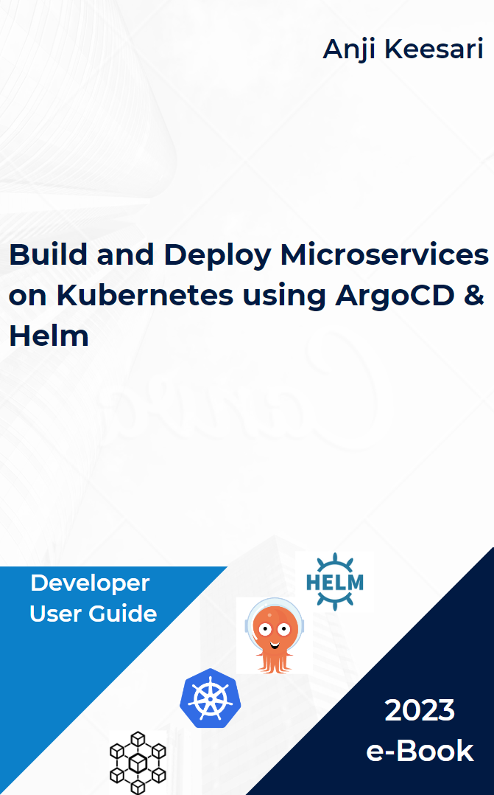

# eBook 

## Introduction

Welcome to my eBook, `Build & Deploy Microservices on Kubernetes using ArgoCD & Helm`. I'm really excited about modern software development and how we put it into actions. So, I decided to share what I know in this awesome eBook. It's like a developer guide to help you build and put into action microservices using the latest and greatest tools."

To dive into the complete contents of this eBook, simply follow the link provided below. This link will take you to the eBook's dedicated website, where you can access and explore each chapter as it becomes available. I'm excited to have you join me on this journey of learning and discovery, and I look forward to your feedback as we continue to enhance and refine this valuable resource.

Thank you for your interest, and happy reading!"

<a href="https://akeesari.github.io/micros-k8s/" target="_blank">Build & Deploy Microservices on Kubernetes using ArgoCD & Helm</a>

!!! note
    This book is still a work in progress, However, you are still welcome to continue reading what has been written so far.

